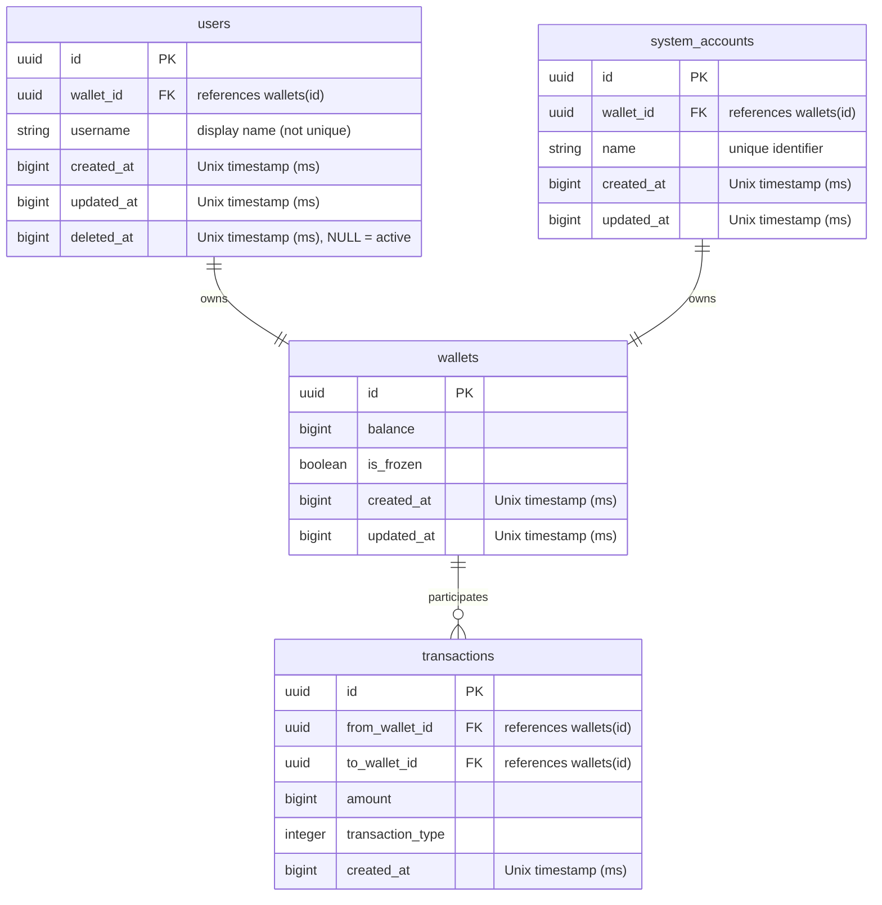

# Database Design Document

## Overview

This document defines the PostgreSQL database schema for the Community Token System. All primary keys use UUIDs for distributed system compatibility and security.

**UUID Strategy:**
- **System Account**: Random UUID v4 for Account ID, references separate Wallet UUID
- **System Wallet**: Random UUID v4 for Wallet ID (owned by system account)
- **Regular Users**: Random UUID v4 for User ID, references separate Wallet UUID
- **Regular Wallets**: Random UUID v4 for Wallet ID
- **Transactions**: Random UUID v4 (high-volume data)
- **Design Principle**: Wallets are conceptually independent entities; users/system_accounts reference wallets (not vice versa)

## Design Principles

1. **UUID Primary Keys**: All tables use UUIDs for primary keys (all entities use random UUID v4)
2. **Wallet-Centric Design**: Wallets are conceptually independent; users/system_accounts reference wallets via `wallet_id` (enables easy external ID provider migration)
3. **Separation of Users and System Accounts**: Regular users and system accounts are managed in separate tables for clear domain boundaries and migration flexibility
4. **Application-Layer Type System**: Transaction types managed as integers with application constants
5. **Soft Deletes**: Users table uses soft deletion with `deleted_at` timestamp (preserves wallet references)
6. **Unix Timestamps**: All timestamps stored as BIGINT (Unix epoch in milliseconds) for timezone-free consistency
7. **Data Integrity**: Foreign key constraints and check constraints ensure consistency
8. **Concurrency Control**: Row-level locking prevents race conditions in balance operations
9. **Performance**: Strategic indexing for common query patterns

## Entity Relationship Diagram



## Table Definitions

### 1. users

Core table for regular user identity. Separated from system accounts for clear domain boundaries and future migration to external identity providers.

```sql
CREATE TABLE users (
    id UUID PRIMARY KEY,
    wallet_id UUID NOT NULL UNIQUE,
    username VARCHAR(255) NOT NULL,
    created_at BIGINT NOT NULL,
    updated_at BIGINT NOT NULL,
    deleted_at BIGINT,

    CONSTRAINT username_not_empty CHECK (LENGTH(TRIM(username)) > 0),
    CONSTRAINT username_valid_chars CHECK (username ~ '^[a-zA-Z0-9_-]+$'),
    CONSTRAINT username_length CHECK (LENGTH(username) BETWEEN 3 AND 255),
    CONSTRAINT created_at_positive CHECK (created_at > 0),
    CONSTRAINT updated_at_after_created CHECK (updated_at >= created_at),
    CONSTRAINT deleted_at_after_created CHECK (deleted_at IS NULL OR deleted_at >= created_at),
    CONSTRAINT fk_wallet FOREIGN KEY (wallet_id)
        REFERENCES wallets(id) ON DELETE RESTRICT
);

-- Indexes
CREATE INDEX idx_users_wallet_id ON users(wallet_id);
CREATE INDEX idx_users_deleted_at ON users(deleted_at) WHERE deleted_at IS NOT NULL;

-- Comments
COMMENT ON TABLE users IS 'Regular user identity (excludes system accounts for clean migration to external ID providers)';
COMMENT ON COLUMN users.id IS 'Primary key (UUID v4 for regular users)';
COMMENT ON COLUMN users.wallet_id IS 'Reference to owned wallet (one-to-one relationship)';
COMMENT ON COLUMN users.username IS 'Display name (3-255 chars, alphanumeric + underscore/hyphen, not unique - users identified by external OAuth ID)';
COMMENT ON COLUMN users.created_at IS 'Unix timestamp in milliseconds';
COMMENT ON COLUMN users.updated_at IS 'Unix timestamp in milliseconds';
COMMENT ON COLUMN users.deleted_at IS 'Soft delete Unix timestamp in milliseconds (NULL = active)';
```

**Key Design Decisions:**

* **Separated from system accounts** - enables clean migration to external identity providers (IDaaS)
* `wallet_id` references wallets (reversed from traditional design) - wallet-centric architecture
* Soft delete with `deleted_at` preserves wallet references and transaction history
* **Username is NOT unique** - users are identified by external OAuth provider ID (Discord, Swarm, etc.)
* Username is a display name only, restricted to alphanumeric characters, underscore, and hyphen (3-255 chars)
* Unix timestamps (milliseconds) for timezone-free consistency
* Temporal constraints ensure logical timestamp ordering
* `ON DELETE RESTRICT` prevents wallet deletion while user exists

### 2. system_accounts

System accounts with token issuance authority. Separated from regular users for clear domain boundaries.

```sql
CREATE TABLE system_accounts (
    id UUID PRIMARY KEY,
    wallet_id UUID NOT NULL UNIQUE,
    name VARCHAR(255) NOT NULL UNIQUE,
    created_at BIGINT NOT NULL,
    updated_at BIGINT NOT NULL,

    CONSTRAINT name_not_empty CHECK (LENGTH(TRIM(name)) > 0),
    CONSTRAINT name_valid_chars CHECK (name ~ '^[a-z0-9_]+$'),
    CONSTRAINT name_length CHECK (LENGTH(name) BETWEEN 3 AND 255),
    CONSTRAINT created_at_positive CHECK (created_at > 0),
    CONSTRAINT updated_at_after_created CHECK (updated_at >= created_at),
    CONSTRAINT fk_wallet FOREIGN KEY (wallet_id)
        REFERENCES wallets(id) ON DELETE RESTRICT
);

-- Indexes
CREATE INDEX idx_system_accounts_wallet_id ON system_accounts(wallet_id);

-- Comments
COMMENT ON TABLE system_accounts IS 'System accounts with token issuance authority (separated from users for migration flexibility)';
COMMENT ON COLUMN system_accounts.id IS 'Primary key (UUID v4)';
COMMENT ON COLUMN system_accounts.wallet_id IS 'Reference to owned wallet (one-to-one relationship)';
COMMENT ON COLUMN system_accounts.name IS 'Unique identifier (lowercase alphanumeric + underscore only, e.g., system_account_communitytoken)';
COMMENT ON COLUMN system_accounts.created_at IS 'Unix timestamp in milliseconds';
COMMENT ON COLUMN system_accounts.updated_at IS 'Unix timestamp in milliseconds';
```

**Key Design Decisions:**

* **Separated from users table** - system accounts remain in internal database when users migrate to external ID providers
* `wallet_id` references wallets - consistent with wallet-centric architecture
* **Name is UNIQUE** - system accounts identified by name (unlike users identified by OAuth)
* Name restricted to lowercase alphanumeric + underscore for system stability
* **No soft delete** - system accounts are permanent infrastructure
* System accounts use random UUID v4 for account ID
* `ON DELETE RESTRICT` prevents wallet deletion while system account exists

### 3. wallets

Wallet management completely independent from owners. Referenced by users and system_accounts (not vice versa).

```sql
CREATE TABLE wallets (
    id UUID PRIMARY KEY,
    balance BIGINT NOT NULL DEFAULT 0,
    is_frozen BOOLEAN NOT NULL DEFAULT FALSE,
    created_at BIGINT NOT NULL,
    updated_at BIGINT NOT NULL,

    CONSTRAINT balance_non_negative CHECK (balance >= 0),
    CONSTRAINT created_at_positive CHECK (created_at > 0),
    CONSTRAINT updated_at_after_created CHECK (updated_at >= created_at)
);

-- Comments
COMMENT ON TABLE wallets IS 'Token wallets - conceptually independent entities referenced by users/system_accounts';
COMMENT ON COLUMN wallets.id IS 'Primary key (UUID v4)';
COMMENT ON COLUMN wallets.balance IS 'Current token balance (integer, no decimals)';
COMMENT ON COLUMN wallets.is_frozen IS 'Frozen wallets cannot send/receive tokens (system wallets cannot be frozen - enforced by trigger). Beyond MVP feature - included in schema from start for consistency';
COMMENT ON COLUMN wallets.created_at IS 'Unix timestamp in milliseconds';
COMMENT ON COLUMN wallets.updated_at IS 'Unix timestamp in milliseconds';

-- Auto-vacuum settings for high-update table
ALTER TABLE wallets SET (
    autovacuum_vacuum_scale_factor = 0.05,
    autovacuum_analyze_scale_factor = 0.02,
    autovacuum_vacuum_cost_limit = 1000
);
```

**Key Design Decisions:**

* **No owner reference** - wallets are conceptually independent; owners reference wallets instead
* This design enables clean migration of users to external ID providers (wallets remain untouched)
* `balance` uses `BIGINT` for integer-only token amounts (range: -9,223,372,036,854,775,808 to 9,223,372,036,854,775,807)
* `is_frozen` flag enables wallet freezing feature (both sending and receiving) - **Beyond MVP feature**
* **System wallet protection**: Trigger prevents freezing system wallets (verified via reverse lookup) - **Beyond MVP feature**
* Unix timestamps (milliseconds) for timezone-free consistency
* Aggressive auto-vacuum settings for frequently updated balances
* **Maximum flexibility**: Wallet lifecycle independent of owner lifecycle

### 4. transactions

All token transfers including issuance, distribution, and wallet-to-wallet transfers.

```sql
CREATE TABLE transactions (
    id UUID PRIMARY KEY,
    from_wallet_id UUID NOT NULL,
    to_wallet_id UUID NOT NULL,
    amount BIGINT NOT NULL,
    transaction_type INTEGER NOT NULL,
    created_at BIGINT NOT NULL,

    CONSTRAINT amount_positive CHECK (amount > 0),
    CONSTRAINT transaction_type_valid CHECK (transaction_type >= 1 AND transaction_type < 100),
    CONSTRAINT created_at_positive CHECK (created_at > 0),
    CONSTRAINT fk_from_wallet FOREIGN KEY (from_wallet_id)
        REFERENCES wallets(id) ON DELETE RESTRICT,
    CONSTRAINT fk_to_wallet FOREIGN KEY (to_wallet_id)
        REFERENCES wallets(id) ON DELETE RESTRICT
);

-- Indexes
CREATE INDEX idx_transactions_created_at ON transactions(created_at DESC);
CREATE INDEX idx_transactions_transaction_type ON transactions(transaction_type, created_at DESC);
CREATE INDEX idx_transactions_self_transfer ON transactions(from_wallet_id, to_wallet_id)
    WHERE from_wallet_id = to_wallet_id;

-- Comments
COMMENT ON TABLE transactions IS 'All token transactions including issuance, distribution, and transfers (immutable)';
COMMENT ON COLUMN transactions.id IS 'Primary key (UUID v4)';
COMMENT ON COLUMN transactions.from_wallet_id IS 'Sender wallet ID';
COMMENT ON COLUMN transactions.to_wallet_id IS 'Recipient wallet ID';
COMMENT ON COLUMN transactions.amount IS 'Transfer amount in integer tokens (must be positive)';
COMMENT ON COLUMN transactions.transaction_type IS 'Transaction type code (1-99). Application layer defines constants: 1=transfer, others TBD';
COMMENT ON COLUMN transactions.created_at IS 'Unix timestamp in milliseconds';

-- Auto-vacuum settings for insert-only table
ALTER TABLE transactions SET (
    autovacuum_enabled = on,
    autovacuum_vacuum_insert_scale_factor = 0.1
);
```

**Key Design Decisions:**

* **Immutable records**: UPDATE and DELETE operations are prevented by database triggers (see Transaction Immutability Enforcement section)
* `ON DELETE RESTRICT` prevents accidental wallet deletion with transaction history
* Self-transfers (from_wallet_id = to_wallet_id) represent new token issuance
* Separate index for self-transfers to optimize issuance queries
* Unix timestamps (milliseconds) for timezone-free consistency
* **References wallets instead of users** - balance operations independent of user management
* **Transaction type as INTEGER** - Application layer defines constants (1-99 range enforced by CHECK constraint)
* Indexed by transaction_type for efficient filtering and analytics
* Auto-vacuum optimized for insert-only workload

## Application Layer Constants

### Transaction Types

The `transaction_type` field in the `transactions` table uses integer codes (1-99). The application layer should define constants for these values.

| Code | Constant Name | Description |
|------|---------------|-------------|
| 1 | TRANSFER | Token transfer (includes issuance, distribution, and peer-to-peer) |
| 2-99 | TBD | To Be Determined |

**Notes:**
- The database CHECK constraint enforces values 1-99 (0 is not allowed). This prevents bugs where uninitialized integer variables (which default to 0 in many languages) are inadvertently stored in the database.
- Currently only `TRANSFER` (1) is defined; other types will be determined based on future requirements
- Application logic can differentiate transaction semantics (issuance, distribution, etc.) by:
  - Checking if `from_wallet_id = to_wallet_id` (issuance)
  - Checking if sender/recipient is a system account (distribution)

## Data Management Strategy

### Soft Deletes

The system uses different deletion strategies for each table based on their specific requirements:

| Table | Deletion Strategy | Rationale |
|-------|-------------------|-----------|
| `users` | **Soft Delete** (`deleted_at`) | • Preserves wallet references and transaction history<br>• Enables account recovery and audit trail<br>• Wallet remains accessible for historical queries<br>• Application logic should exclude soft-deleted users from active queries |
| `system_accounts` | **No Deletion** | • System accounts are permanent infrastructure<br>• No soft delete mechanism (no deleted_at column)<br>• Cannot be deleted while wallet exists (ON DELETE RESTRICT)<br>• System stability requires persistent system accounts |
| `wallets` | **No Direct Deletion** | • Protected by `ON DELETE RESTRICT` foreign key from users/system_accounts<br>• Cannot be deleted while referenced by any owner<br>• When user is soft deleted, wallet_owners VIEW excludes it (deleted_at IS NULL filter)<br>• Transaction history requires wallet records to remain intact |
| `transactions` | **Immutable (No Modification/Deletion)** | • Transactions are permanent records enforced by database triggers<br>• UPDATE/DELETE operations are blocked at database level<br>• Ensures complete audit trail integrity<br>• All economic history must be preserved<br>• Corrections handled through compensating transactions, not deletion |

**Soft Delete Implementation for Users:**

```sql
-- Example soft delete function
CREATE OR REPLACE FUNCTION soft_delete_user(user_uuid UUID)
RETURNS BOOLEAN AS $$
DECLARE
    current_time_ms BIGINT;
BEGIN
    current_time_ms := (EXTRACT(EPOCH FROM NOW()) * 1000)::BIGINT;

    UPDATE users
    SET deleted_at = current_time_ms,
        updated_at = current_time_ms
    WHERE id = user_uuid
      AND deleted_at IS NULL;

    RETURN FOUND;
END;
$$ LANGUAGE plpgsql;
```

**Important Notes:**
- Soft deleted users (`deleted_at IS NOT NULL`) should be excluded from active user queries
- Their wallets remain in the database for historical integrity (excluded from `wallet_owners` VIEW)
- Account reactivation can be implemented by setting `deleted_at = NULL`
- Username is not unique, so deleted usernames can be reused by other users

### Orphan Wallet Detection

Since wallets are independent entities, it's important to detect wallets that are not owned by any user or system account:

```sql
-- Function to detect orphan wallets (not owned by any user/system_account)
CREATE OR REPLACE FUNCTION check_orphan_wallets()
RETURNS TABLE(wallet_id UUID, balance BIGINT) AS $$
BEGIN
    RETURN QUERY
    SELECT w.id, w.balance
    FROM wallets w
    WHERE NOT EXISTS (SELECT 1 FROM users WHERE wallet_id = w.id)
      AND NOT EXISTS (SELECT 1 FROM system_accounts WHERE wallet_id = w.id);
END;
$$ LANGUAGE plpgsql;

COMMENT ON FUNCTION check_orphan_wallets() IS
    'Returns wallets not referenced by any user or system_account. ' ||
    'Should return empty result in normal operation.';

-- Example usage: Regular monitoring (should be empty)
SELECT * FROM check_orphan_wallets();
```

**Monitoring Strategy:**
- Run this check periodically (e.g., daily via cron job)
- Alert if any orphan wallets are detected
- Investigate root cause (application bug, incomplete transaction, etc.)
- In normal operation, this query should always return zero rows

### Automatic Timestamp Updates

```sql
-- Trigger function for updating updated_at (Unix timestamp in milliseconds)
CREATE OR REPLACE FUNCTION update_updated_at_unix()
RETURNS TRIGGER AS $$
BEGIN
    NEW.updated_at = (EXTRACT(EPOCH FROM NOW()) * 1000)::BIGINT;
    RETURN NEW;
END;
$$ LANGUAGE plpgsql;

-- Apply to relevant tables
CREATE TRIGGER update_users_updated_at
    BEFORE UPDATE ON users
    FOR EACH ROW EXECUTE FUNCTION update_updated_at_unix();

CREATE TRIGGER update_system_accounts_updated_at
    BEFORE UPDATE ON system_accounts
    FOR EACH ROW EXECUTE FUNCTION update_updated_at_unix();

CREATE TRIGGER update_wallets_updated_at
    BEFORE UPDATE ON wallets
    FOR EACH ROW EXECUTE FUNCTION update_updated_at_unix();
```

### Transaction Immutability Enforcement

The transactions table is immutable to ensure complete audit trail integrity. This is enforced at the database level with triggers that prevent any modifications or deletions.

```sql
-- Trigger function to prevent transaction modification
CREATE OR REPLACE FUNCTION prevent_transaction_modification()
RETURNS TRIGGER AS $$
BEGIN
    RAISE EXCEPTION 'Transactions are immutable and cannot be modified or deleted';
END;
$$ LANGUAGE plpgsql;

-- Prevent UPDATE on transactions
CREATE TRIGGER prevent_transaction_update
    BEFORE UPDATE ON transactions
    FOR EACH ROW EXECUTE FUNCTION prevent_transaction_modification();

-- Prevent DELETE on transactions
CREATE TRIGGER prevent_transaction_delete
    BEFORE DELETE ON transactions
    FOR EACH ROW EXECUTE FUNCTION prevent_transaction_modification();
```

**Important Notes:**
- All transaction records are permanent and cannot be changed after creation
- Corrections must be handled through new compensating transactions
- This ensures complete economic history preservation and audit trail integrity
- Application layer should handle transaction reversal logic through new opposing transactions

### Balance Consistency Validation

```sql
-- Function to validate transaction against sender wallet balance
-- Includes row-level locking to prevent race conditions (double-spending)
CREATE OR REPLACE FUNCTION validate_transaction_balance()
RETURNS TRIGGER AS $$
DECLARE
    sender_balance BIGINT;
    sender_frozen BOOLEAN;
    recipient_frozen BOOLEAN;
    is_system_wallet BOOLEAN;
    is_self_transfer BOOLEAN;
BEGIN
    -- Check if this is a self-transfer (new issuance)
    is_self_transfer := (NEW.from_wallet_id = NEW.to_wallet_id);

    -- 🔒 CRITICAL: Lock sender wallet row to prevent race conditions
    -- This prevents double-spending attacks where multiple transactions
    -- validate against the same balance concurrently
    SELECT balance, is_frozen
    INTO sender_balance, sender_frozen
    FROM wallets
    WHERE id = NEW.from_wallet_id
    FOR UPDATE;  -- Row-level lock

    IF NOT FOUND THEN
        RAISE EXCEPTION 'Sender wallet not found';
    END IF;

    -- Check if sender wallet is frozen (Beyond MVP feature)
    IF sender_frozen THEN
        RAISE EXCEPTION 'Sender wallet is frozen';
    END IF;

    -- New issuance: only system accounts can issue to themselves
    IF is_self_transfer THEN
        -- Check if wallet is owned by a system account (reverse lookup)
        SELECT EXISTS(
            SELECT 1 FROM system_accounts WHERE wallet_id = NEW.from_wallet_id
        ) INTO is_system_wallet;

        IF NOT is_system_wallet THEN
            RAISE EXCEPTION 'Only system account wallets can perform self-transfers (issuance)';
        END IF;
        -- No balance check for issuance
        RETURN NEW;
    END IF;

    -- 🔒 Lock recipient wallet to check frozen status (Beyond MVP feature)
    SELECT is_frozen INTO recipient_frozen
    FROM wallets
    WHERE id = NEW.to_wallet_id
    FOR UPDATE;

    IF NOT FOUND THEN
        RAISE EXCEPTION 'Recipient wallet not found';
    END IF;

    -- Check if recipient wallet is frozen (Beyond MVP feature)
    IF recipient_frozen THEN
        RAISE EXCEPTION 'Recipient wallet is frozen';
    END IF;

    -- Regular transfer: check sufficient balance
    IF sender_balance < NEW.amount THEN
        RAISE EXCEPTION 'Insufficient balance: has %, needs %',
            sender_balance, NEW.amount;
    END IF;

    RETURN NEW;
END;
$$ LANGUAGE plpgsql;

CREATE TRIGGER check_transaction_balance
    BEFORE INSERT ON transactions
    FOR EACH ROW EXECUTE FUNCTION validate_transaction_balance();

COMMENT ON FUNCTION validate_transaction_balance() IS
    'Validates transaction balance and prevents double-spending via row-level locking. ' ||
    'Also checks frozen status for both sender and recipient wallets (Beyond MVP feature). ' ||
    'Uses reverse lookup to verify system account ownership.';
```

### Balance Update Trigger

```sql
-- Function to update wallet balances after transaction
CREATE OR REPLACE FUNCTION update_wallet_balances()
RETURNS TRIGGER AS $$
DECLARE
    current_time_ms BIGINT;
BEGIN
    current_time_ms := (EXTRACT(EPOCH FROM NOW()) * 1000)::BIGINT;

    -- Decrease sender balance (skip for self-transfers/issuance)
    IF NEW.from_wallet_id != NEW.to_wallet_id THEN
        UPDATE wallets
        SET balance = balance - NEW.amount,
            updated_at = current_time_ms
        WHERE id = NEW.from_wallet_id;
    END IF;

    -- Increase recipient balance
    UPDATE wallets
    SET balance = balance + NEW.amount,
        updated_at = current_time_ms
    WHERE id = NEW.to_wallet_id;

    RETURN NEW;
END;
$$ LANGUAGE plpgsql;

CREATE TRIGGER update_balances_after_transaction
    AFTER INSERT ON transactions
    FOR EACH ROW EXECUTE FUNCTION update_wallet_balances();
```

### System Wallet Protection (Beyond MVP)

```sql
-- Prevent system wallets from being frozen (Beyond MVP feature)
CREATE OR REPLACE FUNCTION prevent_system_wallet_freeze()
RETURNS TRIGGER AS $$
BEGIN
    IF NEW.is_frozen = TRUE THEN
        -- Check if wallet is owned by a system account (reverse lookup)
        IF EXISTS (
            SELECT 1 FROM system_accounts
            WHERE wallet_id = NEW.id
        ) THEN
            RAISE EXCEPTION 'System wallets cannot be frozen';
        END IF;
    END IF;
    RETURN NEW;
END;
$$ LANGUAGE plpgsql;

CREATE TRIGGER check_system_wallet_freeze
    BEFORE INSERT OR UPDATE OF is_frozen ON wallets
    FOR EACH ROW EXECUTE FUNCTION prevent_system_wallet_freeze();

COMMENT ON FUNCTION prevent_system_wallet_freeze() IS
    'Prevents freezing system wallets via reverse lookup to system_accounts table. Beyond MVP feature - included in schema from start for consistency';
```

### Helper Functions for Unix Timestamps

```sql
-- Convert Unix timestamp (milliseconds) to human-readable format
CREATE OR REPLACE FUNCTION unix_to_timestamp(unix_ms BIGINT)
RETURNS TIMESTAMP WITH TIME ZONE AS $$
BEGIN
    RETURN TO_TIMESTAMP(unix_ms / 1000.0);
END;
$$ LANGUAGE plpgsql IMMUTABLE;

-- Convert timestamp to Unix (milliseconds)
CREATE OR REPLACE FUNCTION timestamp_to_unix(ts TIMESTAMP WITH TIME ZONE)
RETURNS BIGINT AS $$
BEGIN
    RETURN (EXTRACT(EPOCH FROM ts) * 1000)::BIGINT;
END;
$$ LANGUAGE plpgsql IMMUTABLE;

-- Get current Unix timestamp in milliseconds
CREATE OR REPLACE FUNCTION current_unix_ms()
RETURNS BIGINT AS $$
BEGIN
    RETURN (EXTRACT(EPOCH FROM NOW()) * 1000)::BIGINT;
END;
$$ LANGUAGE plpgsql VOLATILE;

COMMENT ON FUNCTION unix_to_timestamp(BIGINT) IS 'Convert Unix timestamp (ms) to TIMESTAMPTZ for readability';
COMMENT ON FUNCTION timestamp_to_unix(TIMESTAMP WITH TIME ZONE) IS 'Convert TIMESTAMPTZ to Unix timestamp (ms)';
COMMENT ON FUNCTION current_unix_ms() IS 'Get current time as Unix timestamp (ms)';

-- Example usage:
-- SELECT unix_to_timestamp(created_at) FROM transactions WHERE id = :id;
-- SELECT * FROM transactions WHERE created_at > timestamp_to_unix('2024-11-25 00:00:00+00'::TIMESTAMPTZ);
```

### Wallet Owner Lookup View

For queries that need to resolve wallet ownership (reverse lookup from wallet to owner):

```sql
-- View to simplify wallet owner lookup
CREATE VIEW wallet_owners AS
SELECT
    wallet_id,
    'user' as owner_type,
    id as owner_id,
    username as owner_name
FROM users
WHERE deleted_at IS NULL
UNION ALL
SELECT
    wallet_id,
    'system_account' as owner_type,
    id as owner_id,
    name as owner_name
FROM system_accounts;

COMMENT ON VIEW wallet_owners IS
    'Unified view for reverse wallet ownership lookup. ' ||
    'Combines users and system_accounts for simplified queries.';

-- Example usage:
-- Get transaction history with owner names
SELECT
    t.*,
    wo_from.owner_name as from_owner,
    wo_from.owner_type as from_type,
    wo_to.owner_name as to_owner,
    wo_to.owner_type as to_type
FROM transactions t
LEFT JOIN wallet_owners wo_from ON t.from_wallet_id = wo_from.wallet_id
LEFT JOIN wallet_owners wo_to ON t.to_wallet_id = wo_to.wallet_id
ORDER BY t.created_at DESC;
```

**Usage Notes:**
- Use this VIEW for read-heavy operations requiring owner information
- Excludes soft-deleted users (active users only)
- `owner_type` field distinguishes between 'user' and 'system_account'
- Performance: UNION ALL is efficient since the sets are mutually exclusive

## Security Considerations

### Concurrency Control and Race Condition Prevention

The system provides **multiple layers of defense** against double-spending and race conditions:

**Layer 1 (Database Constraint)**: `balance_non_negative` CHECK constraint prevents negative balances at database level

**Layer 2 (Application Layer)**: Atomic conditional UPDATE queries (recommended primary defense)

**Layer 3 (Database Triggers)**: Balance validation triggers with row-level locking (fallback defense)

### Recommended Application-Layer Implementation

For **optimal performance and concurrency**, implement transfers using atomic conditional UPDATEs instead of relying solely on triggers:

```sql
-- Efficient peer-to-peer transfer (single atomic operation per wallet)
BEGIN TRANSACTION ISOLATION LEVEL READ COMMITTED;

-- 1. Atomically decrease sender balance (fails if insufficient balance or frozen)
UPDATE wallets
SET balance = balance - :amount,
    updated_at = :current_time_ms
WHERE id = :from_wallet_id
  AND balance >= :amount
  AND is_frozen = false;

-- Check affected rows (0 = insufficient balance or frozen)
-- GET DIAGNOSTICS affected_rows = ROW_COUNT; -- if needed for error details

-- 2. Atomically increase recipient balance (fails if frozen)
UPDATE wallets
SET balance = balance + :amount,
    updated_at = :current_time_ms
WHERE id = :to_wallet_id
  AND is_frozen = false;

-- 3. Record transaction
INSERT INTO transactions (id, from_wallet_id, to_wallet_id, amount, transaction_type, created_at)
VALUES (:tx_id, :from_wallet_id, :to_wallet_id, :amount, 1, :current_time_ms);

COMMIT;
```

**Benefits of this approach:**
- No explicit row locking needed (UPDATE is inherently atomic)
- Minimal lock duration (balance check + update in single operation)
- High throughput even under concurrent load
- Low deadlock risk
- Works perfectly with `READ COMMITTED` isolation level

**Transaction Isolation Level:**

```sql
-- Recommended: READ COMMITTED with atomic conditional UPDATEs
BEGIN TRANSACTION ISOLATION LEVEL READ COMMITTED;
```

**Why READ COMMITTED is sufficient:**
- Atomic conditional UPDATEs provide serialization at operation level
- CHECK constraint (`balance >= 0`) provides final safety net
- Higher isolation levels (SERIALIZABLE) cause unnecessary transaction failures and retries
- Optimal balance between safety and performance for 20-member community

### Fallback: Trigger-Based Validation

The database includes trigger-based validation (`validate_transaction_balance()`) as a **safety fallback**. However, for production use, the application-layer atomic UPDATE approach above is **strongly recommended** for better performance.

**Note**: The row-level locking in `validate_transaction_balance()` trigger provides protection against double-spending, but has higher overhead than atomic UPDATEs.

### Connection Pooling

Configure PostgreSQL for connection pooling using PgBouncer:

```ini
# pgbouncer.ini - Recommended configuration for Community Token System
[databases]
communitytoken = host=localhost port=5432 dbname=communitytoken

[pgbouncer]
pool_mode = transaction           # Best for short transactions
max_client_conn = 1000            # Maximum client connections
default_pool_size = 25            # Connections per database
reserve_pool_size = 5             # Emergency reserve
reserve_pool_timeout = 3          # Seconds before using reserve
max_db_connections = 100          # Total DB connections
server_idle_timeout = 600         # Close idle server connections after 10 minutes
server_lifetime = 3600            # Recycle connections after 1 hour
```

**Application Configuration:**
* Implement connection timeout and retry logic
* Use exponential backoff for transaction retries on serialization failures
* Monitor connection pool usage and adjust `default_pool_size` based on load

## Performance Optimization

### 1. Query Optimization

Common query patterns and their indexes:

```sql
-- Wallet balance lookup by user
-- Uses: idx_users_wallet_id
SELECT w.balance
FROM users u
JOIN wallets w ON u.wallet_id = w.id
WHERE u.id = :user_id;

-- Transaction history by wallet (simple, wallet-centric)
-- No JOIN needed, just filter by wallet_id
SELECT t.*
FROM transactions t
WHERE t.from_wallet_id = :wallet_id OR t.to_wallet_id = :wallet_id
ORDER BY t.created_at DESC;

-- Transaction history with owner names (uses wallet_owners VIEW)
SELECT
    t.*,
    wo_from.owner_name as from_owner,
    wo_to.owner_name as to_owner
FROM transactions t
LEFT JOIN wallet_owners wo_from ON t.from_wallet_id = wo_from.wallet_id
LEFT JOIN wallet_owners wo_to ON t.to_wallet_id = wo_to.wallet_id
WHERE t.from_wallet_id = :wallet_id OR t.to_wallet_id = :wallet_id
ORDER BY t.created_at DESC;

-- Calculate total issuance (system wallet self-transfers)
-- Uses: idx_transactions_self_transfer, idx_system_accounts_wallet_id
SELECT SUM(t.amount) as total_issuance
FROM transactions t
WHERE t.from_wallet_id = t.to_wallet_id
  AND EXISTS (
    SELECT 1 FROM system_accounts sa WHERE sa.wallet_id = t.from_wallet_id
  );

-- Calculate circulating supply (non-system wallet balances)
SELECT SUM(w.balance) as circulation
FROM wallets w
WHERE EXISTS (
    SELECT 1 FROM users u WHERE u.wallet_id = w.id AND u.deleted_at IS NULL
);

-- Get system wallet balances (treasury pool)
-- Uses: idx_system_accounts_wallet_id
SELECT sa.name, w.balance
FROM system_accounts sa
JOIN wallets w ON sa.wallet_id = w.id
ORDER BY w.balance DESC;

-- Filter transactions by type
-- Uses: idx_transactions_transaction_type
-- Example: Get all transfer transactions (transaction_type = 1)
SELECT
    t.*,
    unix_to_timestamp(t.created_at) as created_at_readable,
    wo_from.owner_id as from_owner_id,
    wo_from.owner_name as from_owner_name,
    wo_to.owner_id as to_owner_id,
    wo_to.owner_name as to_owner_name
FROM transactions t
LEFT JOIN wallet_owners wo_from ON t.from_wallet_id = wo_from.wallet_id
LEFT JOIN wallet_owners wo_to ON t.to_wallet_id = wo_to.wallet_id
WHERE t.transaction_type = 1
ORDER BY t.created_at DESC;

-- Query transactions within a time range using Unix timestamps
-- Uses: idx_transactions_created_at
SELECT t.*, unix_to_timestamp(t.created_at) as created_at_readable
FROM transactions t
WHERE t.created_at >= timestamp_to_unix('2024-11-01 00:00:00+00'::TIMESTAMPTZ)
  AND t.created_at < timestamp_to_unix('2024-12-01 00:00:00+00'::TIMESTAMPTZ)
ORDER BY t.created_at DESC;

-- Transaction statistics by type
-- Uses: idx_transactions_transaction_type
SELECT
    transaction_type,
    COUNT(*) as transaction_count,
    SUM(amount) as total_amount,
    AVG(amount) as avg_amount,
    MIN(amount) as min_amount,
    MAX(amount) as max_amount
FROM transactions
GROUP BY transaction_type
ORDER BY transaction_type;
```

### 2. Partitioning Strategy (Future)

When transaction volume grows, consider partitioning by time:

```sql
-- Example monthly partitioning for transactions
CREATE TABLE transactions_2025_01 PARTITION OF transactions
    FOR VALUES FROM ('2025-01-01') TO ('2025-02-01');
```

### 3. Materialized Views

For economic analysis (Phase 2):

```sql
CREATE MATERIALIZED VIEW token_statistics AS
SELECT
    (SELECT SUM(t.amount)
     FROM transactions t
     WHERE t.from_wallet_id = t.to_wallet_id
       AND EXISTS (SELECT 1 FROM system_accounts sa WHERE sa.wallet_id = t.from_wallet_id)
    ) as total_issuance,
    (SELECT SUM(w.balance)
     FROM wallets w
     WHERE EXISTS (SELECT 1 FROM users u WHERE u.wallet_id = w.id AND u.deleted_at IS NULL)
    ) as circulating_supply,
    (SELECT SUM(w.balance)
     FROM wallets w
     WHERE EXISTS (SELECT 1 FROM system_accounts sa WHERE sa.wallet_id = w.id)
    ) as system_pool,
    (SELECT COUNT(*)
     FROM users
     WHERE deleted_at IS NULL
    ) as total_users,
    (SELECT COUNT(*)
     FROM transactions
    ) as total_transactions,
    current_unix_ms() as updated_at;

CREATE UNIQUE INDEX ON token_statistics (updated_at);

-- Refresh periodically (consider using pg_cron extension)
REFRESH MATERIALIZED VIEW CONCURRENTLY token_statistics;

-- Example: Automated refresh with pg_cron (requires extension)
-- CREATE EXTENSION IF NOT EXISTS pg_cron;
-- SELECT cron.schedule(
--     'refresh-token-stats',
--     '*/15 * * * *',  -- Every 15 minutes
--     $$REFRESH MATERIALIZED VIEW CONCURRENTLY token_statistics$$
-- );
```

## Migration Strategy

### Phase 1: Initial Schema

1. Create core tables: `users`, `wallets`, `transactions`
2. Create essential indexes
3. Set up triggers for balance updates and validation
4. Run seeding to create initial system account and token issuance

#### Seeding Data

The seeding process creates the initial system wallet, system account, and performs the first token issuance:

```sql
-- 1. Create system wallet FIRST (must exist before system_account references it)
-- Note: Application layer generates random UUIDs and current timestamp before insertion
INSERT INTO wallets (id, balance, is_frozen, created_at, updated_at)
VALUES (
    :system_wallet_id,  -- Random UUID v4 (generated by application)
    0,  -- Initial balance is 0, will be updated by trigger after issuance
    FALSE,
    :current_time_ms,  -- Unix timestamp in milliseconds from application
    :current_time_ms
);

-- 2. Create system account (references the wallet created above)
INSERT INTO system_accounts (id, wallet_id, name, created_at, updated_at)
VALUES (
    :system_account_id,  -- Random UUID v4 (generated by application)
    :system_wallet_id,   -- References system wallet created in step 1
    'system_account_communitytoken',
    :current_time_ms,
    :current_time_ms
);

-- 3. Create initial token issuance transaction (self-transfer)
-- This mints 10,000 tokens to the system wallet
INSERT INTO transactions (id, from_wallet_id, to_wallet_id, amount, transaction_type, created_at)
VALUES (
    :transaction_id,     -- Random UUID v4 (generated by application)
    :system_wallet_id,   -- System wallet ID (self-transfer)
    :system_wallet_id,   -- Self-transfer indicates issuance
    10000,
    1,                   -- TRANSFER type
    :current_time_ms
);

-- After this seeding, the system wallet balance will be 10,000 due to the trigger
```

**Important Notes:**
- **Creation order is critical**: wallet → system_account → transaction (foreign key dependency)
- System Account ID: Random UUID v4 (generated by application)
- System Wallet ID: Random UUID v4 (generated by application)
- System account name: `system_account_communitytoken` (unique identifier)
- Initial token supply: 10,000 tokens created via self-transfer (issuance)
- The balance update trigger automatically sets the system wallet balance to 10,000
- Regular users: Create wallet first, then user with random UUID v4 for both IDs

### Phase 2: Analytics & Optimization

1. Create materialized views for analytics
2. Set up partitioning for high-volume tables
3. Add monitoring and alerting

**Note**: Authentication is managed by external IDaaS (Identity as a Service) platform and is not part of this database schema.

## Backup and Recovery

### Backup Strategy

1. **Continuous Archiving**: Enable WAL archiving for point-in-time recovery
2. **Daily Full Backups**: Automated using `pg_dump`
3. **Transaction Log Backup**: Continuous backup of transaction table
4. **Retention**: 30 days for full backups, 90 days for critical transaction data

### Recovery Procedures

1. **Balance Reconstruction**: Recalculate wallet balances from transaction history
2. **Consistency Check**: Validate `SUM(wallets.balance) = total_issuance`
3. **Data Integrity**: Verify all wallets have corresponding users

## Monitoring and Maintenance

### Key Metrics

1. **Balance Consistency**: `SUM(wallets.balance) = total_issuance` (from self-transfers)
2. **Transaction Volume**: Track daily/hourly transaction rates
3. **System Wallet Activity**: Alert on system wallet operations
4. **Frozen Wallets**: Monitor frozen wallet count and balances

### Regular Maintenance

```sql
-- Vacuum and analyze
VACUUM ANALYZE users;
VACUUM ANALYZE wallets;
VACUUM ANALYZE transactions;

-- Reindex periodically
REINDEX TABLE users;
REINDEX TABLE wallets;
REINDEX TABLE transactions;

-- Verify balance consistency
SELECT
    (SELECT SUM(balance) FROM wallets) as total_balance,
    (SELECT SUM(amount) FROM transactions WHERE from_wallet_id = to_wallet_id) as total_issuance,
    (SELECT SUM(balance) FROM wallets) = (SELECT SUM(amount) FROM transactions WHERE from_wallet_id = to_wallet_id) as is_consistent;

-- Create monitoring view for balance consistency
CREATE VIEW v_balance_consistency AS
SELECT
    (SELECT SUM(balance) FROM wallets) as current_total_balance,
    (SELECT SUM(amount) FROM transactions WHERE from_wallet_id = to_wallet_id) as total_issuance,
    (SELECT SUM(balance) FROM wallets) =
        (SELECT SUM(amount) FROM transactions WHERE from_wallet_id = to_wallet_id) as is_consistent,
    current_unix_ms() as checked_at;

-- Check consistency (returns TRUE if consistent, FALSE with WARNING if not)
CREATE OR REPLACE FUNCTION check_balance_consistency()
RETURNS BOOLEAN AS $$
BEGIN
    IF (SELECT NOT is_consistent FROM v_balance_consistency) THEN
        RAISE WARNING 'Balance inconsistency detected at %',
            unix_to_timestamp((SELECT checked_at FROM v_balance_consistency));
        RETURN FALSE;
    END IF;
    RETURN TRUE;
END;
$$ LANGUAGE plpgsql;
```

## Summary

This database design provides:

* **UUID-based architecture** for distributed systems
* **Unix timestamps (milliseconds)** for timezone-free consistency across all services
* **Separation of concerns** - user identity and wallet management are independent
* **Integer-only tokens** - no decimal places, using BIGINT for simplicity
* **Flexible type system** - integer-based transaction types with application-layer constants
* **Strong data integrity** with constraints and triggers
* **Concurrency control** - row-level locking prevents race conditions and double-spending
* **Economic tracking** with balance validation and transaction history
* **Performance optimization** through strategic indexing and auto-vacuum tuning
* **Security** with immutable transaction records and wallet freezing capability (Beyond MVP)
* **Scalability** with partitioning strategy for future growth
* **IDaaS integration** for authentication delegation
* **Wallet freezing capability** for security features (blocks both sending and receiving) - **Beyond MVP feature**
* **Helper functions** for Unix timestamp conversion and readability

The schema supports all requirements from the Community Token System design document while maintaining flexibility for future enhancements. Key architectural decisions:

* **UUID Strategy**:
  * All entities use random UUID v4 (system accounts, system wallets, users, wallets, transactions)
  * Application layer generates all UUIDs before database insertion
* **Wallet-Centric Architecture**:
  * Wallets are conceptually independent entities (no owner foreign key)
  * Users and system_accounts reference wallets via `wallet_id` (reverse relationship)
  * Enables clean migration to external ID providers (DROP TABLE users, wallets untouched)
* **Separation of Users and System Accounts**:
  * Separate tables for domain boundary clarity
  * Users can migrate to external IDaaS without affecting system accounts
  * System accounts remain in internal database as permanent infrastructure
* **Unix Timestamp Strategy** (milliseconds):
  * Complete timezone independence - no session timezone issues
  * Language-agnostic integer representation
  * JavaScript/Go standard compatibility
  * Helper functions for human-readable conversion
* **One-to-one relationship**: Each user/system_account has exactly one wallet (enforced by UNIQUE constraint on wallet_id)
* **Wallet-based transactions**: All transfers reference wallets, not users/system_accounts
* **Integer-only tokens**: BIGINT for balance and amount (no decimal places for simplicity)
* **Application-controlled IDs and timestamps**: All UUIDs and timestamps generated by application layer, not database defaults
* **Reverse lookup optimization**: `wallet_owners` VIEW for efficient owner name resolution
* **Transaction type codes**: Integer-based type system (1-99) with application-layer constant definitions
* **Concurrency safety**: Row-level locking (FOR UPDATE) on wallet queries during transaction validation
* **Authentication delegation**: IDaaS handles auth, keeping token system focused on economic functionality
* **Database isolation**: SERIALIZABLE or REPEATABLE READ recommended for financial consistency
