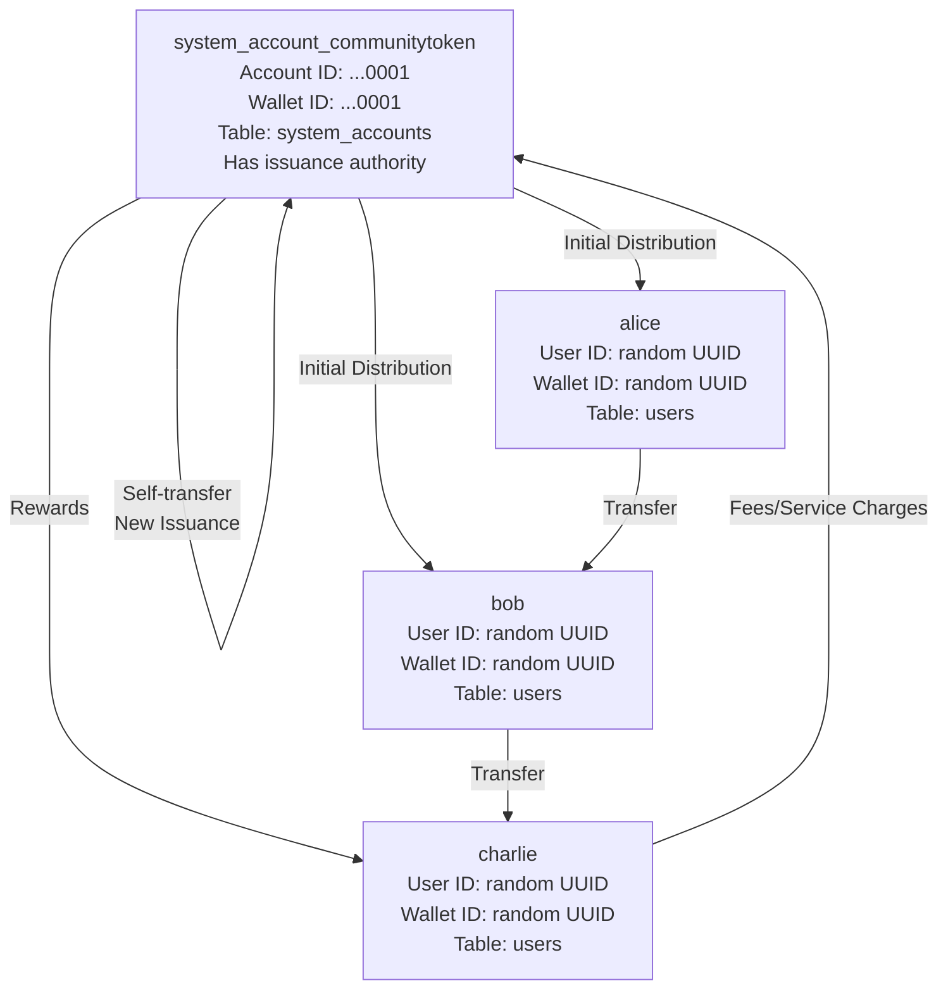
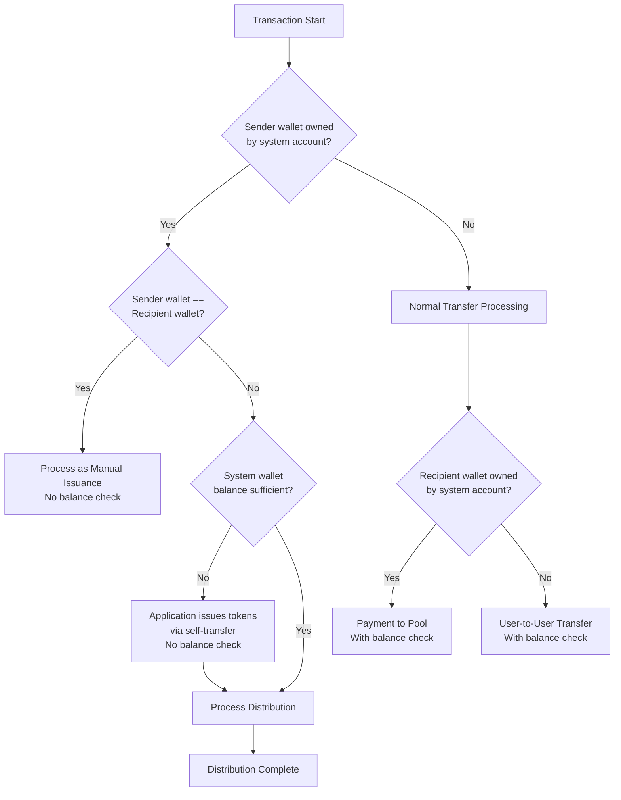
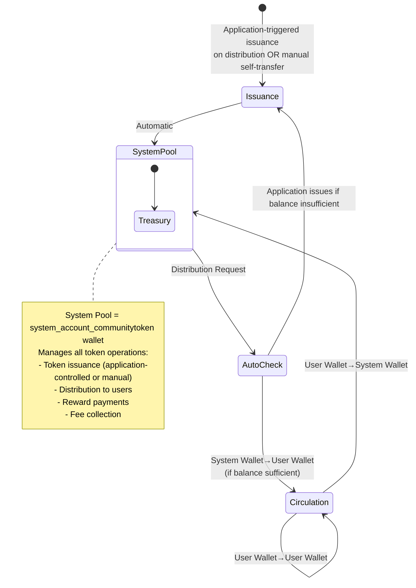
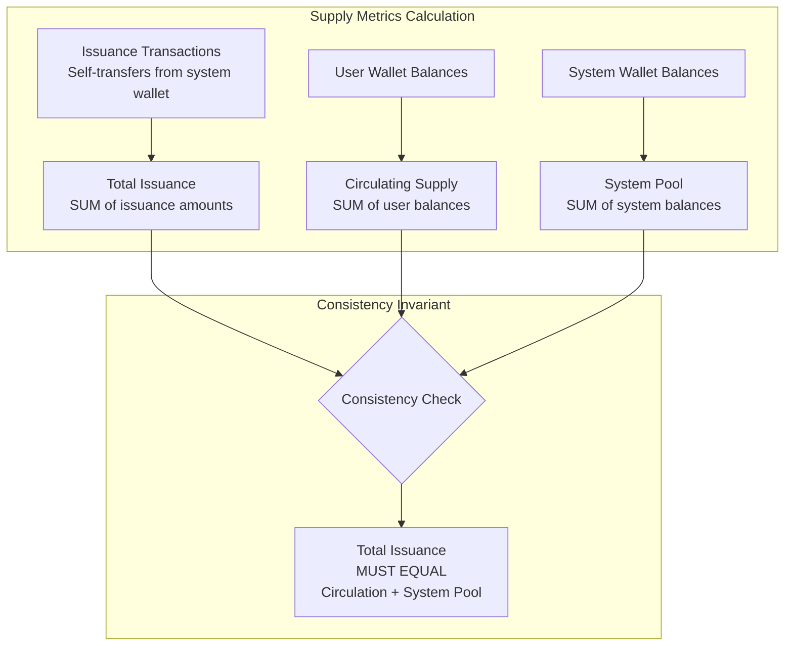
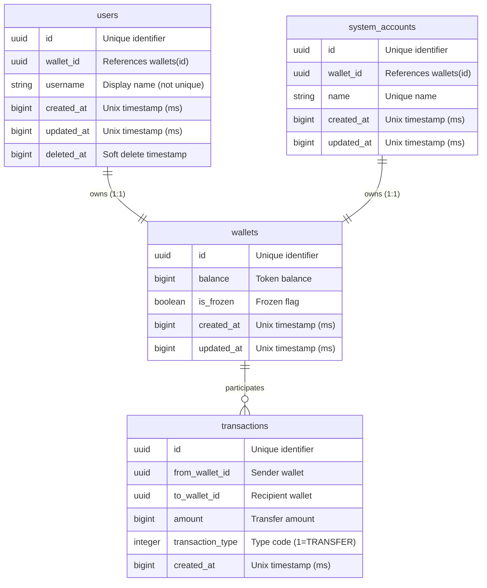
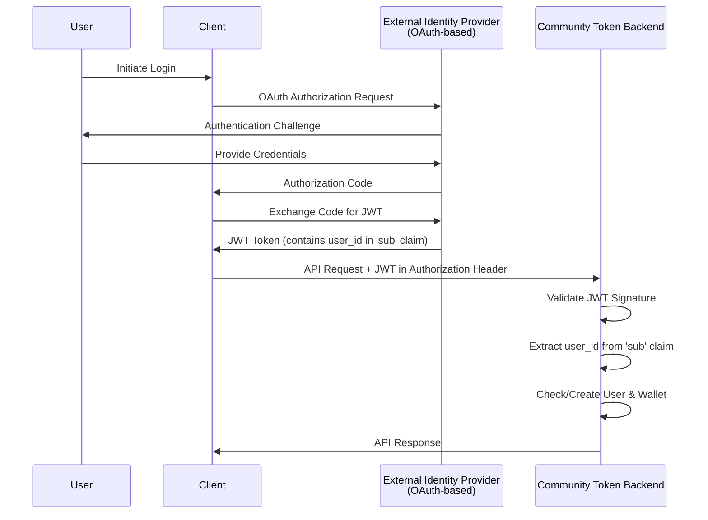
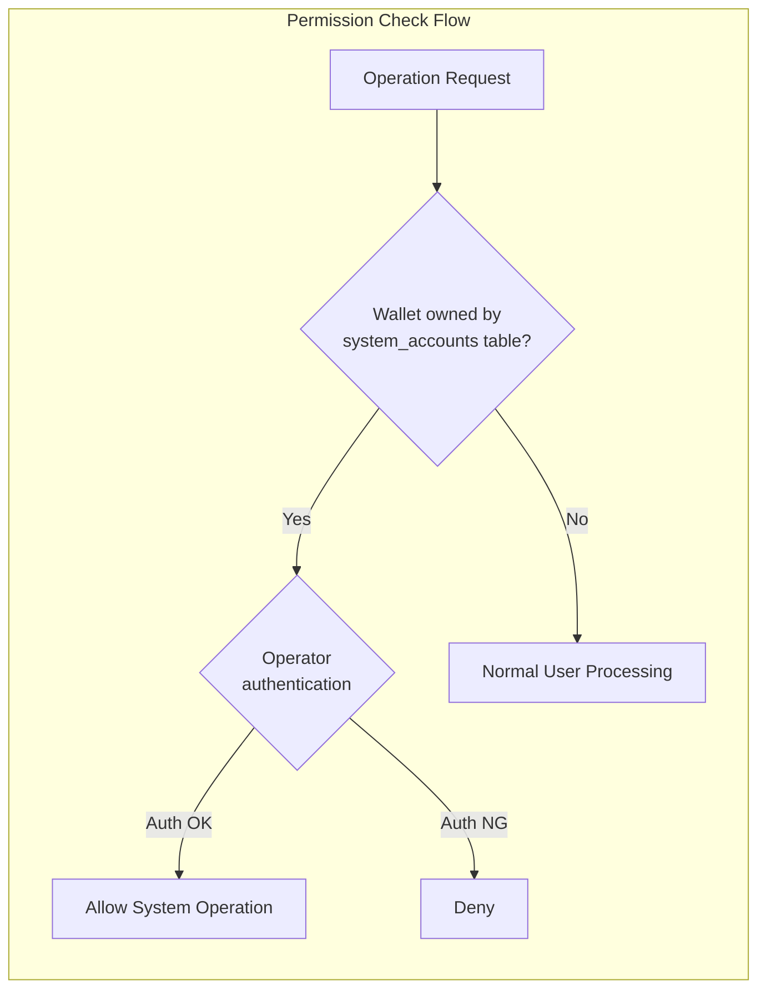

# Community Token System Design Document

## 1. Design Philosophy

### Basic Principles

* Simplicity First: System that is easy to understand and operate for a 20-member community
* Incremental Expansion: Start with minimal configuration and add features as needed
* Economic Flexibility: Design that doesn't prevent future expansion to economic simulation

### Core Concept

**Transfer-Centric Design**: At its core, all economic activities are modeled as token transfers between wallets. While the system maintains a `transaction_type` field for extensibility, the fundamental architecture ensures that every transaction can be understood and processed as a transfer operation.

**Incremental Type System**:
- **Phase 1 (MVP)**: All transactions use `transaction_type = 1 (TRANSFER)`, with semantics determined by wallet ownership (system vs. user) and transfer direction
- **Phase 2+**: Additional transaction types (2-99) can be introduced as implementation evolves, while maintaining backward compatibility with the transfer-based model

## 2. System Overview



**Note**: Each account represents a User + Wallet pair (1:1 relationship). Transfers occur between wallets.

### Account Types

| User Type | Table | Wallet Capabilities | Purpose |
| --------- | ----- | ------------------- | ------- |
| System Account | `system_accounts` | New issuance (self-transfer), distribution, receive | Token management, community treasury |
| User Account | `users` | Transfer, receive | Regular members |

## 3. Transaction Flows and Semantics

Transaction determination logic based on sender/recipient wallet ownership:



### Transaction Patterns and Semantics

| Sender Wallet Owner | Recipient Wallet Owner | Meaning | Balance Check | Auto-Issuance | Example |
| ------------------- | ---------------------- | ------- | ------------- | ------------- | ------- |
| System (self) | System (self) | Manual Issuance | None | N/A | Explicit token creation |
| System | User | Distribution | No (application issues if insufficient) | Yes (application-controlled) | Rewards, initial distribution |
| User | User | Normal Transfer | Yes | No | Peer-to-peer transaction |
| User | System | Pool Transfer | Yes | No | Fees, service charges |

**Key Change**: When system account transfers to users, the application layer automatically issues new tokens if balance is insufficient. The application detects insufficient balance, creates an issuance transaction (self-transfer), and then proceeds with distribution. This eliminates the need for manual token issuance operations in most cases.

## 4. Economic Model

Token Lifecycle:



Supply Management:



**Supply Metrics:**
- **Total Issuance**: Sum of all token amounts created through system wallet self-transfers (issuance transactions)
- **Circulating Supply**: Sum of all token balances held in user wallets
- **System Pool**: Sum of all token balances held in system account wallets

**Consistency Invariant**:
- Total Issuance = Circulating Supply + System Pool
- This equality must always hold to ensure economic integrity
- Issuance transactions are the source of truth for total supply

## 5. System Account Configuration

### MVP System Account

The system operates with a single system account that manages all token operations.

### Primary System Account Specification

| Property | Value | Description |
| -------- | ----- | ----------- |
| Table | `system_accounts` | Separate table from regular users |
| Name | `system_account_communitytoken` | Unique identifier for the system account |
| Account ID | Random UUID v4 | Application-generated UUID for system account |
| Wallet ID | Random UUID v4 | Application-generated UUID for system wallet (different from Account ID) |

### Responsibilities

* **Token Issuance**: Create new tokens via self-transfer
* **Initial Distribution**: Distribute tokens to community members
* **Reward Distribution**: Periodic reward payments to users
* **Fee Collection**: Receive service charges and fees from users
* **Treasury Management**: Maintain community token reserves

## 6. Incremental Expansion Strategy

### Phase 1: MVP (Months 1-2)

* Create initial system account (`system_account_communitytoken` with random UUID v4)
* Basic transfer functionality with application-controlled issuance
* Initial distribution to community members

### Phase 2: Operational Optimization (Months 3-4)

* Introduce automated reward distribution logic
* Implement fee collection mechanisms
* Add transaction history and analytics
* Deploy wallet freezing feature for security management

### Phase 3: Economic Analysis (Months 5-6)

* System account-specific revenue/expense analysis
* Visualization of issuance and circulation
* Monitor economic indicators

## 7. Data Design

### Core Entities

The system consists of three main entities with the following conceptual relationships:



**Design Principles:**
* **UUID-based System**: All entities use application-generated UUIDs (no database-level generation)
  * System Account: Random UUID v4 for Account ID and separate random UUID v4 for Wallet ID
  * Users: Separate random UUID v4 for User ID and Wallet ID
  * Transactions: Random UUID v4
  * Rationale: Application-controlled IDs enable deterministic testing
* **User-Wallet Separation**: Identity (Users/System Accounts) and balance management (Wallets) are independent concerns
* **Wallet-based Transactions**: All transfers reference wallets, not users directly
* **Integer Tokens**: Token amounts use integers (no decimal places) for simplicity
* **Transaction Immutability**: Once created, transactions cannot be modified or deleted
  * Ensures complete audit trail integrity
  * All economic history is permanently preserved
  * Corrections require new compensating transactions

> **Note**: For detailed database schema, constraints, indexes, and implementation details, see `database.md`

### Important Constraints and Validations

| Constraint | Condition | Reason |
| ---------- | --------- | ------ |
| New Issuance Condition | Sender is system wallet AND sender == recipient | Only system accounts can issue |
| Balance Check Exemption | New issuance only | Allow creation from nothing |
| Negative Balance Prohibition | All wallets | Maintain accounting integrity |
| One Wallet Per User | Each user has exactly one wallet | Simplified balance management |
| Transaction Immutability | All transactions | No UPDATE or DELETE allowed on transactions table |
| Frozen Wallet Check | All transfers | Frozen wallets cannot send or receive tokens |

## 8. Security and Access Control

### Authentication & Authorization

The system uses an external identity provider for user authentication and JWT-based authorization.

**Identity Provider Integration:**



**Authentication Flow:**

1. **User Authentication**: User authenticates via external OAuth-based identity provider (e.g., Discord, Google, custom OAuth server)
2. **JWT Issuance**: Identity provider issues JWT token containing user identifier in `sub` claim
3. **Client Authorization**: Client includes JWT in `Authorization: Bearer <token>` header for all API requests
4. **Backend Validation**: Backend validates JWT signature using identity provider's public key
5. **User Identification**: Backend extracts `user_id` from JWT `sub` claim
6. **Auto-Provisioning**: On first successful JWT validation, backend automatically creates user account and wallet if not exists
7. **Resource Authorization**: Backend authorizes operations based on extracted user identity

**JWT Token Structure:**

```json
{
  "sub": "550e8400-e29b-41d4-a716-446655440000",
  "iss": "https://identity-provider.example.com",
  "aud": "community-token-api",
  "exp": 1735689600,
  "iat": 1735603200
}
```

**Key Requirements:**

* **JWT Validation**: Backend must validate JWT signature on every API request
* **User ID Extraction**: `sub` claim contains the unique user identifier (UUID format)
* **Auto-Registration**: First-time users are automatically registered with wallet creation
* **Token Expiration**: Expired tokens are rejected (checked via `exp` claim)
* **Issuer Validation**: `iss` claim must match configured identity provider
* **Audience Validation**: `aud` claim must match this application's identifier

**Resource Access Control:**

* **User Resources**: Users can only access their own wallet, transactions, and profile
* **System Account**: Not accessible via user API endpoints (admin-only operations)
* **Transaction History**: Users can only view transactions involving their own wallet
* **Profile Updates**: Users can only modify their own username
* **Statistics**: Economic statistics are publicly accessible to all authenticated users

### API Architecture & Boundaries

The system exposes user operations through REST API, while administrative operations are performed via direct database access.

**Operation Boundaries:**

| Operation Category | Access Method | Authentication | Phase |
| ------------------ | ------------- | -------------- | ----- |
| User Registration | Automatic (on first JWT validation) | External IdP + JWT | Phase 1 |
| Wallet Inquiry | REST API | JWT Required | Phase 1 |
| Peer-to-Peer Transfer | REST API | JWT Required | Phase 1 |
| Transaction History | REST API | JWT Required | Phase 1 |
| Economic Statistics | REST API | JWT Required | Phase 2 |
| Token Issuance | Application-controlled (on distribution if needed) | N/A | Phase 1 |
| Token Distribution | Direct Database Access | Database Credentials | Phase 1 |
| Wallet Freeze/Unfreeze | Direct Database Access | Database Credentials | Phase 1 |

**REST API Design Principles:**

* **Authentication**: All API endpoints require valid JWT (except health checks)
* **Authorization**: Resource ownership validated on every request
* **Idempotency**: Transfer operations use client-provided idempotency keys
* **Error Handling**: Consistent error response format with error codes
* **Rate Limiting**: Per-user rate limits to prevent abuse
* **Versioning**: API versioned via URL path (`/v1/...`)

**Administrative Operations (Direct Database Access in MVP):**

* **Token Issuance**: Application-controlled on distribution (manual self-transfer also possible)
* **Batch Distribution**: Distribute tokens to multiple users atomically
* **Wallet Management**: Freeze/unfreeze wallets for security
* **System Monitoring**: Query system account balances and audit logs

**Future Expansion (Phase 2+):**

* Administrative operations may be exposed as authenticated API endpoints with admin role validation
* Webhook support for transaction notifications
* Batch operation APIs with async processing

### System Account Protection



### Operational Rules

* **System Account Operations**: Require admin privileges with full audit trail logging
* **User Account Generation**: Random UUID v4 for both User ID and Wallet ID
* **Regular Audits**: Periodic verification of total supply consistency

### Wallet Freezing

The system supports wallet freezing as a security measure to prevent unauthorized or suspicious account activity.

**Freezing Behavior:**
* **Frozen wallets cannot send tokens** - All outgoing transfers are blocked
* **Frozen wallets cannot receive tokens** - All incoming transfers are blocked
* **Balance remains accessible for viewing** - Read-only operations are unaffected

**Use Cases:**
* **Security Incidents**: Immediate response to compromised accounts or suspicious activity
* **Dispute Resolution**: Temporary freeze during investigation of fraudulent transactions
* **Compliance**: Enforcement of community rules or regulatory requirements
* **Account Recovery**: Prevent further damage while account ownership is being verified

**Administrative Controls:**
* Only system administrators can freeze/unfreeze wallets
* Freezing operations must be logged with full audit trail including:
  * Administrator ID
  * Target wallet ID
  * Reason for freeze/unfreeze
  * Timestamp
* System account wallet cannot be frozen (enforced by database constraint)

## 9. Migration and Upgrades

### Future Extensions

**Automated Distribution:**
* Automated reward distribution using the system account
* Scheduled batch operations with async processing

**Multiple System Accounts:**

The architecture supports multiple system accounts for future integrations with external systems. When integrating with external platforms (e.g., partner platforms, cross-chain bridges, external treasuries), each integrated system can have its own system account with dedicated wallet.

Benefits:
* Isolated token management per integration
* Same economic model with multiple issuance authorities
* Independent balance tracking for each integration

Examples:
* Cross-chain bridge accounts
* Partner platform reserves
* DAO treasuries
* External service providers
