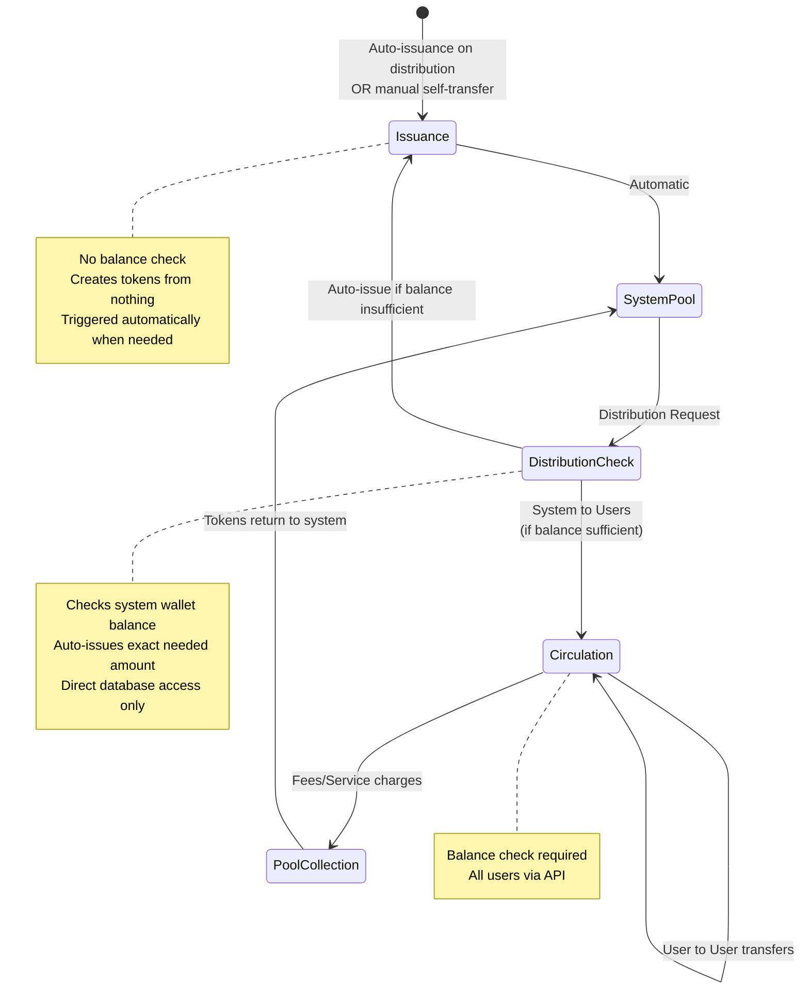

# Community Token System - Features and Requirements

## 1. Overview

The Community Token System provides a comprehensive platform for managing community tokens through a transfer-centric economic model. The system serves small to medium-sized communities (starting at 20 members) with capabilities for token issuance, distribution, peer-to-peer transfers, and economic analytics.

**Core Principles**:
- Transfer-centric design: All economic activities modeled as token transfers between wallets
- Incremental expansion: Start with minimal features and add complexity as needed
- Economic transparency: Complete audit trail and statistical visibility
- Security first: Immutable transactions, wallet freezing, and comprehensive logging

**API Specification**: Detailed API endpoints, request/response formats, and error codes are defined separately in the OpenAPI specification. This document focuses on functional requirements and business logic.

## 2. Feature Categories

### 2.1 Identity & Access Management

**Purpose**: Manage user authentication, authorization, and profile information through external identity provider integration.

**Capabilities**:
- User authentication via external identity provider (supports OAuth-based providers)
- User profile management (username updates)
- Resource access control (users can only access their own resources)

**Key Requirements**:
- External identity provider issues JWT tokens containing user_id (sub claim)
- Backend validates JWT signature and extracts user identity
- Users can only access their own resources (wallet, transactions, profile)
- System accounts exist for token issuance but are not user-accessible

**Authentication Flow**:
1. User authenticates via external identity provider
2. Identity provider issues JWT to client
3. Client includes JWT in API requests
4. Backend validates JWT and authorizes operations

---

### 2.2 Wallet Management

**Purpose**: Manage user wallets for token balance tracking and security controls.

**MVP Capabilities**:
- Automatic wallet creation (1:1 with user account)
- Balance inquiry and tracking
- Integer-only balance operations (BIGINT storage)

**Beyond MVP Capabilities**:
- Wallet state visibility (active/frozen status)
- Wallet freezing/unfreezing (via direct database access)

**Key Requirements**:
- Each user has exactly one wallet (enforced by database constraint)
- Wallets use UUID identifiers (separate from user ID for both users and system accounts)
- System account: `system_account_communitytoken` (uses random UUID v4 for account and wallet)
- Balance operations use integer-only arithmetic (no decimals)
- All balance changes tracked via transaction history

**Wallet States** (Beyond MVP):
- Active: Normal operation, can send and receive tokens
- Frozen: Security lockdown, blocks all transfers (managed via direct database access)

---

### 2.3 Token Lifecycle Management

**Purpose**: Manage the complete lifecycle of tokens from issuance through circulation to pool collection.

**Capabilities**:
- Token issuance (new token creation)
- Token distribution (system to users)
- Peer-to-peer transfers
- Pool transfers (fees and service charges)

**Transaction Semantics**:

| From Wallet | To Wallet | Meaning | Balance Check | Auto-Issuance |
|-------------|-----------|---------|---------------|---------------|
| System (self) | System (self) | Manual Issuance | None (mint from nothing) | N/A |
| System | User | Distribution | No (auto-issues if needed) | Yes |
| User | User | Peer Transfer | Yes (sender balance) | No |
| User | System | Pool Transfer | Yes (sender balance) | No |

**Key Requirements**:
- Only system accounts can issue new tokens (self-transfer)
- Issuance has no balance check (creates tokens from nothing)
- **Distribution automatically issues tokens if system wallet balance is insufficient**
- User-to-user transfers require sufficient sender balance
- Frozen wallets cannot participate in transfers
- All transfers are atomic (success or complete rollback)
- Transaction history is immutable (no updates or deletes)

**Token Flow**:

---

### 2.4 Transaction Management

**Purpose**: Record and track all token movements with complete immutability and audit trail.

**Capabilities**:
- Transaction recording (automatic on all transfers)
- Transaction history inquiry
- Transaction filtering (by wallet, type, time range)
- Transaction immutability enforcement

**Key Requirements**:
- Every token movement creates a transaction record
- Transactions are immutable (enforced by database triggers)
- Transaction type distinguishes semantic meaning (Phase 1: all type=1)
- Transactions reference wallets, not users directly
- Amount must be positive integer
- Created timestamp uses Unix milliseconds
- Users can only view transactions involving their wallet

**Transaction Attributes**:
- ID: UUID identifier
- From Wallet ID: Sender wallet
- To Wallet ID: Recipient wallet
- Amount: Positive integer
- Transaction Type: Integer code (1-99)
- Created At: Unix milliseconds timestamp

**Immutability Guarantees**:
- No UPDATE operations allowed on transactions
- No DELETE operations allowed on transactions
- Corrections handled through compensating transactions
- Complete economic history preserved permanently

---

### 2.5 Economic Analytics

**Purpose**: Provide visibility into token economics and transaction patterns for data-driven decision making.

**Capabilities**:
- Supply statistics (issuance, circulation, system pool)
- Transaction statistics (volume, count, averages)
- Time-series analysis
- User activity metrics

**Key Metrics**:

**Supply Metrics**:
- Total Issuance: Sum of all system wallet self-transfers
- Circulating Supply: Sum of all user wallet balances
- System Pool: Sum of all system wallet balances
- Invariant: Total Issuance = Circulating Supply + System Pool

**Transaction Metrics**:
- Total transaction count
- Total transaction volume (sum of amounts)
- Average transaction amount
- Transaction count by type
- Transaction volume by time period

**User Metrics**:
- Total users (all non-deleted accounts)
- Active users (users with non-zero balance)
- User growth rate
- User activity patterns

**Key Requirements**:
- Statistics may be cached for performance (15-minute refresh)
- Time-range filtering for historical analysis
- Statistics available to all authenticated users
- Real-time balance consistency validation
- Historical trend analysis support

---

### 2.6 Security & Compliance

**Purpose**: Ensure system security, prevent fraud, and maintain complete audit trails.

**MVP Capabilities**:
- Transaction immutability (audit trail integrity)
- Double-spending prevention (row-level locking)
- Basic audit logging (all critical operations)
- System wallet protection

**Beyond MVP Capabilities**:
- Wallet freezing (immediate lockdown via direct database access)
- Comprehensive audit logging with reason tracking
- Real-time anomaly detection
- Security incident response automation

**Security Controls**:

**Transaction Security** (MVP):
- Row-level locking prevents race conditions
- Balance checks atomic with transfers
- Transaction validation before commit
- Automatic rollback on any failure
- Transaction immutability enforced by database

**Wallet Freezing** (Beyond MVP):
- Immediate effect (blocks all transfers)
- Managed via direct database access
- Requires reason for audit trail
- Cannot freeze system wallets (database constraint)
- Frozen status visible to users via API

**Audit Trail**:
- **MVP**: Token issuance logged with operator identity and timestamp
- **MVP**: Distribution operations logged with operator identity and reason
- **MVP**: Complete transaction history preserved (immutable)
- **Beyond MVP**: Wallet freeze/unfreeze logged with reason
- **Beyond MVP**: All security events logged for investigation

**Key Requirements**:
- Balance consistency maintained at all times
- Double-spending mathematically impossible
- System wallets have special protections
- Failed transactions leave no side effects
- All administrative operations require authentication

---

### 2.7 Administrative Operations

**Purpose**: Define critical operations that require direct database access (not available via public API).

**MVP Operations**:

**Token Issuance**:
- **Automatic**: Triggered when distribution amount exceeds system wallet balance
- No manual operation required in normal use
- Auto-issues exact amount needed for distribution
- Manual issuance still possible via system wallet self-transfer (optional)
- No balance check (minting from nothing)
- System account: `system_account_communitytoken` (random UUID v4)
- Logged with operator identity and timestamp

**Token Distribution**:
- Distribute from system wallet to multiple users
- Executed via direct database transaction (multiple INSERTs)
- **Automatically issues tokens if system wallet balance is insufficient**
- Atomic operation (all-or-nothing, including auto-issuance)
- Requires reason for audit trail
- Maximum 100 recipients per batch recommended
- Logged with operator identity and timestamp

**Beyond MVP Operations**:

**Wallet Administration** (Beyond MVP):
- Freeze suspicious or compromised wallets
- Unfreeze wallets after investigation
- Executed via direct database UPDATE on wallets table
- Requires reason for audit trail
- Cannot freeze system wallets (enforced by database constraint)
- Logged with operator identity and timestamp

**Key Requirements**:
- MVP operations executed via direct database access only
- All operations logged with operator identity and reason
- Batch operations are atomic (no partial execution)
- **Distribution automatically triggers token issuance if needed**
- Failed operations provide clear error messages
- Beyond MVP: Consider API endpoints for administrative operations

---

## 3. Implementation Scope

### 3.1 MVP: Core Token Economy

**Goal**: Establish basic token economy with issuance, distribution, and peer-to-peer transfers.

**Features**:

**Identity & Access Management**:
- External identity provider integration (OAuth-based)
- User profile retrieval (username, wallet info)
- JWT validation and user identification
- Automatic user registration on first JWT validation

**Wallet Management**:
- Automatic wallet creation (1:1 with user account)
- Wallet balance inquiry
- Basic wallet operations (view only)
- Integer-only balance tracking (BIGINT storage)

**Token Lifecycle**:
- Token issuance (automatic on distribution, no manual operation needed)
- Token distribution (via direct database access, triggers auto-issuance if needed)
- User-to-user transfers (via API)
- Balance validation (atomic with transfers)
- System account: `system_account_communitytoken` (random UUID v4)

**Transaction Management**:
- Transaction recording (immutable)
- Basic transaction history (view own transactions)
- Transaction type = 1 (TRANSFER) for all operations
- Unix millisecond timestamps

**Administrative Operations (Direct Database Access)**:
- Initial system account setup (database seeding script)
- Token distribution to community members (batch up to 100 recipients, auto-issues tokens as needed)
- Manual token issuance via system wallet self-transfer (optional)

**Success Criteria**:
- System account created with zero initial balance
- 20+ community members receive initial distribution
- Tokens automatically issued during distribution
- Peer-to-peer transfers function correctly via API
- All transactions recorded immutably
- Balance consistency maintained (Total Issuance = Circulating Supply + System Pool)
- Administrative database operations documented and tested
- No double-spending incidents
- API response time <500ms for 95th percentile

---

### 3.2 Beyond MVP: Enhanced Features

**Goal**: Add operational tools, security features, analytics, and advanced capabilities.

**Wallet Management**:
- Wallet freezing/unfreezing (direct database access)
- Frozen status visibility via API
- System wallet freeze protection (database constraint)

**Transaction Management**:
- Advanced filtering (by wallet, type, time range)
- Pagination for large result sets (default 50 items)
- Transaction search capabilities
- Context display (before/after balances)

**Economic Analytics**:
- Supply statistics (issuance, circulation, pool) with 15-minute caching
- Transaction statistics (count, volume, averages)
- Time-series economic indicators
- User behavior analysis
- Token velocity calculations
- Distribution effectiveness metrics
- Economic forecasting

**Security & Compliance**:
- Comprehensive audit logging for all administrative operations
- Wallet freeze/unfreeze logging with reason tracking
- Security incident response procedures
- Real-time anomaly detection

**Administrative Operations**:
- API endpoints for token distribution (instead of direct database access)
- API endpoints for wallet freeze/unfreeze (instead of direct database access)
- Scheduled distribution management
- Automated reward calculation scripts
- Economic monitoring dashboards
- Revenue/expense analysis for system account
- Issuance strategy optimization tools

**Advanced Transaction Types**:
- Introduce new transaction_type codes (2-99)
- Smart contract-like conditional transfers
- Scheduled/delayed transfers
- Recurring transfers

**Visualization**:
- Supply and circulation trends
- Transaction volume charts
- User activity heatmaps
- Distribution impact analysis

**Multiple System Accounts** (Future Integration Support):
- Support for external system integrations (cross-chain bridges, partner platforms, DAO treasuries)
- Each integrated system has dedicated system account with issuance authority
- Independent balance tracking per integration
- Same economic model with multiple issuance authorities

---

## 4. Key Use Cases

### UC-1: Initial System Setup

1. Operator creates system account (`system_account_communitytoken`) via database seeding script
2. System wallet created with zero balance (random UUID v4)
3. System ready for first distribution

**Actors**: System Operator (via direct database access)
**Preconditions**: Database initialized
**Postconditions**: System account created with zero balance, ready for distribution
**Method**: Database seeding script
**Note**: No token issuance needed - tokens auto-issued on first distribution

---

### UC-2: Initial Token Distribution (with Auto-Issuance)

1. Operator prepares distribution list (user_ids and amounts)
2. Operator executes database transaction script with reason
3. Script checks system wallet (`system_account_communitytoken`) balance (likely zero on first run)
4. **Script detects insufficient balance, auto-issues exact needed amount via self-transfer**
5. Script validates all recipient wallets exist
6. Script executes atomic batch transfer via SQL transaction (all-or-nothing)
7. System records all transactions (issuance + distributions) with operator identity and reason
8. Users receive tokens in their wallets

**Actors**: System Operator (via direct database access)
**Preconditions**: System account exists, users registered
**Postconditions**: Users have initial token balances, system wallet has leftover balance (if any)
**Method**: Database transaction script with auto-issuance + batch INSERT
**Scope**: MVP feature
**Example**: Distributing 10,000 tokens to 20 users triggers automatic issuance of 10,000 tokens first
**Note**: Wallet freezing check not required in MVP (freezing is Beyond MVP feature)

---

### UC-3: Peer-to-Peer Token Transfer (User)

1. User authenticates via identity provider
2. User specifies recipient wallet ID and amount
3. System validates recipient wallet exists
4. System locks sender wallet row (prevents double-spending)
5. System validates sufficient balance
6. System creates transaction record
7. System updates both wallet balances atomically
8. Transaction appears in both users' history

**Actors**: Token Holder
**Preconditions**: User has sufficient balance, recipient exists
**Postconditions**: Tokens transferred, transaction recorded
**Scope**: MVP feature
**Note**: Wallet freezing validation (sender/recipient) is Beyond MVP feature

---

### UC-4: Wallet Freeze for Security (Beyond MVP)

1. Operator detects suspicious activity
2. Operator executes SQL UPDATE to freeze wallet with reason
3. Database validates wallet is not system wallet (via constraint)
4. Database sets wallet frozen flag to true
5. System logs freeze operation (operator identity, wallet ID, reason, timestamp)
6. Wallet immediately blocks all transfer attempts

**Actors**: System Operator (via direct database access)
**Preconditions**: Suspicious activity detected
**Postconditions**: Wallet frozen, further transfers blocked
**Method**: Direct SQL UPDATE on wallets table
**Scope**: Beyond MVP feature

---

### UC-5: Economic Statistics Review (Beyond MVP)

1. User authenticates via identity provider
2. User requests supply statistics via API
3. System calculates or retrieves cached statistics (15-minute refresh):
   - Total Issuance (sum of system self-transfers)
   - Circulating Supply (sum of user wallet balances)
   - System Pool (sum of system wallet balances)
   - Total Users, Active Users
4. System returns statistics with calculation timestamp
5. User reviews economic health

**Actors**: Community Member
**Preconditions**: System has transaction history
**Postconditions**: Economic statistics viewed
**Scope**: Beyond MVP feature

---

### UC-6: Transaction History Inquiry (User)

1. User authenticates via identity provider
2. User requests transaction history
3. System retrieves transactions involving user's wallet
4. System returns transactions with wallet IDs, amounts, and timestamps
5. User reviews transaction history

**Actors**: Token Holder
**Preconditions**: User has transaction history
**Postconditions**: Transaction history viewed
**Scope**: MVP feature (basic retrieval)
**Note**: Advanced filtering and pagination (default 50 items) are Beyond MVP features

---

### UC-7: Weekly Reward Distribution (with Auto-Issuance) (Beyond MVP)

1. Operator calculates reward amounts based on community activity
2. Operator prepares distribution data (up to 100 recipients)
3. Operator executes database transaction script with reason: "Weekly rewards Q1 2025 W3"
4. Script checks system wallet balance
5. **Script auto-issues tokens if balance insufficient (no manual intervention needed)**
6. Script validates all recipient wallets are active (not frozen, if freeze feature enabled)
7. Script executes atomic batch transfer via SQL transaction (includes auto-issuance if triggered)
8. System logs distribution and issuance (operator identity, total amount, recipient count, reason)
9. Community members receive rewards

**Actors**: System Operator (via direct database access)
**Preconditions**: System account exists (`system_account_communitytoken`), recipients active
**Postconditions**: Rewards distributed, system wallet balance adjusted
**Method**: Database transaction script with auto-issuance + batch INSERT
**Scope**: Automated/scheduled distribution is Beyond MVP feature
**Note**: No need to manually check or manage system wallet balance - auto-issuance handles it

---

## 5. Business Rules & Constraints

### Account & Wallet Rules

- Each user has exactly one wallet (1:1 relationship)
- System accounts have separate random UUID v4 for account_id and wallet_id
- Regular users have separate random UUID v4 for user_id and wallet_id
- Usernames are display names only (not unique identifiers)
- Username format: 3-255 characters, alphanumeric + underscore/hyphen
- User deletion is soft delete (deleted_at timestamp)
- Wallets are never directly deleted (preserved with users)

### Token & Transaction Rules

- All token amounts are positive integers (no decimals)
- Token amounts stored as BIGINT (max ~9.2 quintillion)
- Self-transfers only allowed for system wallets (issuance)
- Issuance has no balance check (creates from nothing)
- **System-to-user transfers automatically trigger issuance if system balance insufficient**
- User-to-user and user-to-system transfers require sufficient sender balance
- Transactions are immutable (no updates or deletes)
- Transaction type must be 1-99 (0 reserved for error detection)
- Phase 1 uses only transaction_type=1 (TRANSFER)

### Balance & Consistency Rules

- Wallet balances cannot be negative
- Total Issuance = Circulating Supply + System Pool (always)
- Balance updates are atomic with transaction creation
- Row-level locking prevents double-spending
- Failed transactions roll back completely (no partial state)

### Security & Access Rules

- Only system accounts can issue tokens (self-transfer)
- System account name: `system_account_communitytoken` (random UUID v4)
- Users can only access their own resources via API
- All administrative operations require audit logging

**Beyond MVP Security Rules**:
- Wallet freeze/unfreeze managed via direct database access (not API)
- System wallets cannot be frozen (enforced by database constraint)
- Frozen wallets cannot send or receive tokens
- Freeze operations require reason for audit trail

### Distribution Rules

- Maximum 100 recipients per batch distribution
- Batch distributions are atomic (all-or-nothing, including auto-issuance)
- **Distribution automatically issues tokens if system wallet balance insufficient**
- Distribution requires reason for audit trail
- Recipient wallets must exist
- (Beyond MVP) Recipient wallets must not be frozen if freeze feature is enabled

---

## 6. Success Criteria

### 6.1 MVP Success Criteria

**Functional Requirements**:
- System account (`system_account_communitytoken`) successfully created with zero initial balance
- Initial distribution completed to 20+ members with automatic token issuance
- 100% of peer-to-peer transfers succeed or fail with clear errors
- Zero balance inconsistencies detected (Total Issuance = Circulating Supply + System Pool)
- All transactions immutably recorded with Unix millisecond timestamps
- Users can view their own transaction history via API
- JWT-based authentication validates all API requests
- Automatic user registration on first JWT validation

**Performance Requirements**:
- API response time <500ms for 95th percentile
- Transaction creation completes in <500ms
- Balance inquiry completes in <100ms
- Transaction history retrieval (basic) in <200ms
- Batch distribution (100 recipients) completes in <5 seconds

**Security Requirements**:
- Zero unauthorized access incidents
- Zero double-spending incidents
- 100% of administrative operations logged with operator identity
- Row-level locking prevents concurrent balance conflicts
- Failed transactions roll back completely (no partial state)

**Data Integrity**:
- Transaction immutability enforced (no UPDATE/DELETE allowed)
- Balance consistency maintained at all times
- Atomic operations (all-or-nothing transfers)
- Integer-only arithmetic (no rounding errors)

---

### 6.2 Beyond MVP Success Criteria

**Wallet Management**:
- Wallet freeze/unfreeze responds within 1 second
- System wallet freeze protection enforced by database constraint
- Frozen status visible to users via API

**Transaction Management**:
- Advanced filtering (by wallet, type, time range) returns accurate results
- Pagination (default 50 items) functions correctly
- Transaction search (any filters) completes in <500ms

**Economic Analytics**:
- Supply statistics match manual calculations (100% accuracy)
- Statistics cached and refreshed every 15 minutes
- Statistics calculation completes in <2 seconds
- Economic trends visualized with <1 day latency
- User behavior patterns identified and actionable
- Token velocity calculated accurately
- Distribution effectiveness measured

**Operational Features**:
- Automated weekly/monthly distribution executes successfully
- Security incidents resolved within 1 hour
- Real-time anomaly detection alerts operators
- Comprehensive audit logging for all freeze/unfreeze operations

**Governance & Sustainability**:
- Issuance decisions based on data-driven metrics
- Community engagement metrics guide policy
- Long-term sustainability demonstrated (24+ months projection)
- Economic simulation supports policy testing

---

## 7. Non-Functional Requirements

### Performance

- API response time: <500ms for 95th percentile
- Database transactions: <100ms for balance operations
- Concurrent users: Support 100 simultaneous transactions
- Transaction throughput: 1000 transactions per minute

### Scalability

- User capacity: 1000+ users without performance degradation
- Transaction history: Millions of records with efficient querying
- Database partitioning: Support for time-based partitioning (Phase 3)

### Reliability

- Uptime: 99.5% availability target
- Data durability: Zero data loss (immutable transactions)
- Balance consistency: 100% accuracy (no rounding errors)
- Atomic operations: All-or-nothing transaction guarantees

### Security

- Authentication: JWT validation on every request
- Authorization: Users can only access their own resources
- Audit trail: 100% coverage of administrative operations
- Double-spending: Prevention via database locking

### Maintainability

- Database migrations: Versioned and reversible
- API versioning: Backward compatibility for 12 months
- Monitoring: Real-time alerting on anomalies
- Logging: Structured logs with request tracing

---

## 8. Future Enhancements

These features extend beyond the current MVP and Beyond MVP scope, representing long-term expansion opportunities.

**Advanced Transaction Types**:
- Introduce new transaction_type codes (2-99) beyond basic TRANSFER
- Smart contract-like conditional transfers
- Scheduled/delayed transfers
- Recurring transfers
- Multi-signature approvals

**Economic Simulation**:
- Predictive modeling of token velocity
- Inflation/deflation scenario analysis
- Distribution strategy optimization
- Economic policy testing sandbox
- Monte Carlo simulations for long-term sustainability

**Integration & Automation**:
- Webhook notifications for transaction events
- API integrations with external services (partner platforms, analytics tools)
- Automated reward calculation based on community activity metrics
- Cross-community token bridges
- External system integrations via multiple system accounts (as described in design.md Section 9)

**Governance**:
- Community voting weighted by token holdings
- Proposal creation and voting mechanisms
- Treasury management through community consensus
- Transparent governance history
- Decentralized decision-making frameworks

**Multiple System Accounts** (External Integration):
- Cross-chain bridge accounts for token portability
- Partner platform reserves for ecosystem collaboration
- DAO treasuries for decentralized governance
- External service provider accounts for third-party integrations
- Each system account maintains independent issuance authority and balance tracking

---

## 9. Summary

The Community Token System provides a complete token economy platform designed for incremental growth:

**Core Strengths**:
- Transfer-centric architecture (simple and flexible)
- Immutable transaction history (complete audit trail)
- Atomic operations (no partial failures)
- Integer-only arithmetic (no rounding errors)
- JWT-based authentication and authorization
- Automatic token issuance on distribution

**Implementation Strategy**:
- **MVP**: Core token economy (issuance, distribution, P2P transfers, basic transaction history)
- **Beyond MVP**: Enhanced features (wallet freezing, analytics, advanced filtering, economic visualization)
- **Future Enhancements**: Advanced capabilities (governance, economic simulation, external integrations)

**Technical Foundation**:
- UUID-based identifiers (application-generated, not database-generated)
- Unix millisecond timestamps
- Database-enforced immutability (no UPDATE/DELETE on transactions)
- Row-level locking for concurrency control
- External identity provider integration (OAuth-based JWT)
- System account: `system_account_communitytoken` (random UUID v4)
- BIGINT token storage (integer-only, max ~9.2 quintillion)

This feature set supports communities from 20 members to 1000+ while maintaining economic transparency, security, and scalability.

For API implementation details (endpoints, request/response formats, error codes), refer to the OpenAPI specification.
