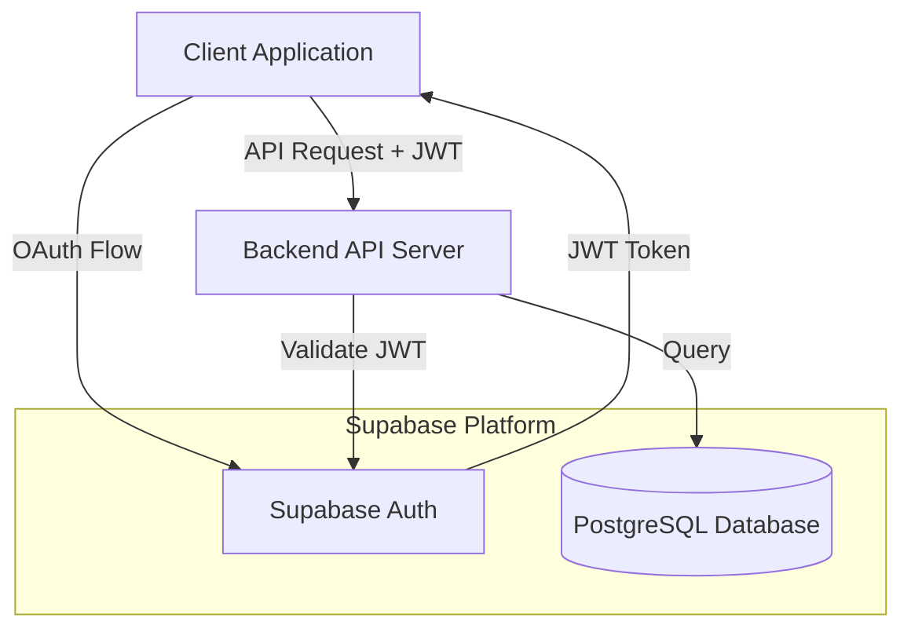
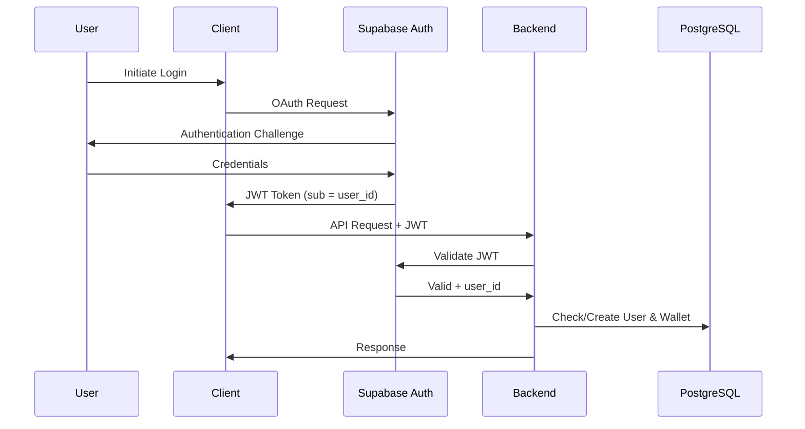

# Technology Stack Selection

## Overview

This document tracks technical decisions for the Community Token System. All decisions are evaluated against requirements specified in `design.md`, `features.md`, and `database.md`.

## Decision Status Legend

- DECIDED: Final decision made
- EVALUATING: Currently under consideration
- PENDING: Awaiting decision

---

## 1. Infrastructure

### Database Hosting: Supabase (DECIDED)

**Decision**: Use Supabase as the primary infrastructure platform for PostgreSQL database and authentication.

**Rationale**:
- Native PostgreSQL support with full feature compatibility (UUID, BIGINT, triggers, functions, constraints)
- Built-in PgBouncer for connection pooling (aligns with database.md recommendations)
- Integrated authentication with OAuth provider support
- Strong local development experience with Docker-based environment
- Migration tools compatible with existing schema design

**Architecture**:



**Supabase Components**:
- **Supabase Database**: PostgreSQL 15+ with full SQL feature support
- **Supabase Auth**: OAuth integration (Discord, Google, custom providers)
- **Supabase Studio**: Web UI for database management and monitoring
- **Supabase CLI**: Local development and migration management

**Performance Evaluation**:

| Requirement | Supabase Free | Supabase Pro | Status |
|-------------|---------------|--------------|--------|
| API response < 500ms | Limited | Yes | Pro tier required for production |
| Concurrent connections: 100 | No (60 max) | Yes (200 max) | Pro tier required |
| 1000 tx/min throughput | TBD | Yes | Requires load testing |

**Recommendation**:
- Development: Free tier
- Production: Pro tier ($25/month minimum)

**Compatibility Notes**:
- Atomic conditional UPDATE pattern (database.md:649-680) is fully compatible with PgBouncer transaction pooling mode
- Row-level locking (FOR UPDATE) works correctly in transaction mode
- All triggers and functions from database.md can be deployed as-is

---

## 2. Backend API

### Language/Framework: TypeScript (DECIDED)

**Decision**: Use TypeScript for backend implementation.

**Rationale**:
- Unified language with potential frontend
- Supabase SDK native support
- Type safety for database operations
- Rich ecosystem for testing and validation

**Migration Path**: Implementation can migrate from Supabase Edge Functions to Cloud Run or Sakura AppRunner without language change.

---

### Initial Implementation: Supabase Edge Functions (DECIDED)

**Decision**: Start with Supabase Edge Functions for MVP phase.

**Rationale**:
- Zero additional infrastructure cost (included in Supabase Pro)
- Single platform for DB + Auth + API
- Sufficient performance for core operations (P2P transfers, balance inquiry, transaction history)
- Simple deployment and development workflow
- No global deployment needed (Japan region sufficient)

**Performance Expectations**:
- API response: 100-500ms (meets < 500ms requirement)
- Transaction creation: 150-400ms (meets < 500ms requirement)
- Balance inquiry: 50-150ms (marginal for < 100ms target)
- Acceptable for MVP with 20-100 users

---

### API Framework: Hono + Zod OpenAPI (DECIDED)

**Decision**: Use Hono with Zod OpenAPI for API implementation and documentation.

**Rationale**:
- Type-safe API schema definition with Zod
- Automatic OpenAPI specification generation
- Runtime request/response validation
- Hono officially supports Cloudflare Workers and Deno (Edge Functions compatible)
- Single source of truth for API contracts
- Interactive API documentation (Swagger UI)

**Key Libraries**:
- `hono` - Web framework
- `@hono/zod-openapi` - OpenAPI integration for Hono
- `zod` - Schema validation and type inference

**Benefits**:

**Type Safety**:
- Zod schemas provide both runtime validation and TypeScript types
- Request/response types automatically inferred
- Compile-time type checking for API handlers

**API Documentation**:
- OpenAPI 3.1 specification auto-generated from Zod schemas
- Swagger UI served at `/doc` endpoint
- API schema available at `/openapi.json`
- Always in sync with implementation (no manual documentation)

**Developer Experience**:
- Single schema definition for validation and documentation
- Clear API contracts for frontend integration
- Automatic request validation before handler execution
- Type-safe response formatting

**Compatibility**:
- Works with Deno runtime (Supabase Edge Functions)
- Migration-ready for Node.js/Bun (Cloud Run/AppRunner)
- Consistent API structure across deployment platforms

**API Structure**:
```
/api/v1
├── /transfers          # P2P token transfers
├── /wallet             # Wallet balance and info
├── /transactions       # Transaction history
└── /doc               # Swagger UI documentation
```

**OpenAPI Features**:
- Request validation (body, query, params)
- Response validation (status codes, schemas)
- Authentication schemes (Bearer JWT)
- Error responses (standardized format)
- API versioning support

---

### Migration Targets (When Edge Functions Reach Limits)

#### Option A: Google Cloud Run (EVALUATING)

**Runtime**: Node.js or Bun in container

**Pros**:
- Standard Node.js/Bun runtime (full npm ecosystem)
- Better cold start than Edge Functions (100-300ms typical)
- More CPU time for complex operations
- Pay-per-use pricing (can be $0 for low traffic)
- Easy migration from Edge Functions (same TypeScript codebase)
- Supports tokyo region (asia-northeast1)

**Cons**:
- Requires containerization (Dockerfile)
- Cold start still exists (though faster than Edge Functions)
- Need to manage container builds

**Cost Estimate**:
- Low traffic (< 1000 requests/day): $0-5/month
- Medium traffic (1000-10000 requests/day): $5-20/month
- Always includes Supabase Pro: $25/month
- Total: $25-45/month

**Database Connection**:
- Direct PostgreSQL connection via Supabase connection string
- Use pgBouncer connection pooling (built into Supabase)
- Standard postgres.js or pg library

#### Option B: Sakura AppRunner (EVALUATING)

**Runtime**: Node.js or Bun container

**Pros**:
- Japan-based infrastructure (low latency for Japanese users)
- Simple deployment from GitHub
- Competitive pricing
- No cold start (always-on instances available)
- Standard Node.js runtime
- Easy migration from Edge Functions (same TypeScript codebase)

**Cons**:
- Less mature platform than Cloud Run
- Smaller ecosystem and community
- Documentation primarily in Japanese

**Cost Estimate**:
- Minimum plan: ~1000 JPY/month (~$7)
- Includes always-on instance (no cold starts)
- Plus Supabase Pro: $25/month
- Total: ~$32/month

**Database Connection**:
- Direct PostgreSQL connection via Supabase connection string
- Use pgBouncer connection pooling (built into Supabase)
- Standard postgres.js or pg library

**Regional Optimization**:
- Both Sakura and Supabase can be in Japan region
- Minimized latency between application and database
- Ideal for Japan-focused deployment

---

### Migration Decision Criteria

**When to migrate from Supabase Edge Functions**:

1. **Performance Issues**:
   - Cold start latency complaints from users
   - API response times consistently > 400ms
   - Need for faster balance inquiry (< 100ms requirement not met)

2. **Functionality Needs**:
   - Need for batch operations in API (token distribution)
   - Complex transaction logic too difficult in Edge Functions
   - Need for longer CPU time (> 50ms operations)

3. **Traffic Growth**:
   - Exceeds 1000 requests/day consistently
   - Need for always-on instances to avoid cold starts

**Migration Target Selection**:

**Choose Cloud Run if**:
- Want mature, well-documented platform
- Need global infrastructure options (even if not used now)
- Prefer Google Cloud ecosystem
- Want pay-per-use pricing flexibility

**Choose Sakura AppRunner if**:
- Prefer Japan-based infrastructure
- Want simpler pricing model
- Comfortable with Japanese documentation
- Want guaranteed always-on instances at lower cost

---

### Rejected Options

**Options Previously Considered but Rejected**:

#### Cloudflare Workers

**Reason for Rejection**: Global edge deployment not needed for Japan-focused system.

**Key advantage rejected**: Sub-millisecond cold starts with global edge deployment

**Why not needed**: System targets Japan region only, making regional deployment (Cloud Run/Sakura) more cost-effective with simpler architecture.

#### Go Language

**Reason for Rejection**: TypeScript chosen for unified language stack.

**Key advantage rejected**: Superior raw performance and native concurrency

**Why not needed**: Performance requirements (1000 tx/min, < 500ms response) achievable with TypeScript + Node.js/Bun. Language unification with frontend more valuable for team productivity.

---

## 3. Authentication & Authorization

### Identity Provider: Supabase Auth (DECIDED)

**Decision**: Use Supabase Auth as the authentication provider with OAuth integration.

**Configuration**:
- OAuth Providers: Discord, Google, custom OAuth servers
- JWT Structure:
  - `sub` claim: User unique identifier (UUID)
  - `iss` claim: "ojiverse"
  - `exp` claim: Token expiration

**Integration Flow**:



**Auto-Provisioning**:
- First JWT validation triggers user creation
- Application creates wallet record automatically
- User and wallet records inserted in single transaction

---

## 4. Administrative Operations

### Implementation Approach: (EVALUATING)

Administrative operations (token distribution, wallet freeze/unfreeze) require careful design per features.md requirements.

#### Option A: PostgreSQL Functions + Supabase RPC (RECOMMENDED)

**Approach**: Implement business logic as PostgreSQL functions, call via Supabase RPC.

**Pros**:
- Transaction guarantees at database level
- Logic encapsulation in database
- Audit trail built into function
- Works with any backend language

**Cons**:
- Complex logic in PL/pgSQL
- Limited debugging tools
- Requires PostgreSQL expertise

#### Option B: Backend Service with Service Role Key

**Approach**: Implement admin logic in backend application, use Supabase service_role key for elevated privileges.

**Pros**:
- Business logic in application language
- Easier testing and debugging
- More flexible error handling

**Cons**:
- Transaction management complexity
- SQL injection risk if not careful
- Audit logging requires manual implementation

#### Option C: Direct SQL Scripts via psql (MVP Recommended)

**Approach**: Admin executes SQL scripts directly via psql or Supabase SQL Editor.

**Pros**:
- Simplest for MVP
- No additional code development needed
- Direct database access
- Fast to implement
- Sufficient for low-frequency administrative operations

**Cons**:
- Manual process (acceptable for MVP with infrequent operations)
- Requires SQL knowledge
- Limited audit trail (mitigated by PostgreSQL logging)
- Not suitable for high-frequency operations

**MVP Implementation**:
- Create SQL script files in repository (e.g., `scripts/distribute_tokens.sql`)
- Document execution procedures
- Use Supabase SQL Editor or psql client
- Log operations manually in audit table

**Migration Path**:
- Move to Option A (PostgreSQL Functions) when admin dashboard is developed
- Or move to Option B if API-based admin operations needed before frontend

**Recommendation**: Option C for MVP (frontend not included), migrate to Option A when admin dashboard developed.

**DECIDED**: Use direct SQL scripts for MVP administrative operations.

---

## 5. Frontend

### Framework: Not included in MVP (DECIDED)

**Decision**: Frontend development (admin dashboard) is excluded from MVP scope.

**Rationale**:
- MVP focuses on core API functionality
- Administrative operations handled via direct database access or CLI tools
- Frontend (admin dashboard) deferred to post-MVP phase
- Reduces MVP complexity and development timeline

**Future Scope** (Post-MVP):
- Admin dashboard for token distribution and monitoring
- Economic statistics visualization
- User portal for wallet and transaction history (optional)

**Framework Options** (for future reference):
- Next.js 14+ (App Router) - Full-stack with SSR
- React + Vite - Client-side SPA
- SvelteKit - Alternative modern framework

---

## 6. Development Tools

### Database Migration: Supabase CLI (DECIDED)

**Decision**: Use Supabase CLI for database migrations.

**Rationale**:
- Native integration with Supabase platform
- Supports SQL migrations and schema diffing
- Local development with supabase start
- Version control friendly (migration files in repository)
- Built-in migration history tracking

**Migration Workflow**:
- Create migration: `supabase migration new <name>`
- Apply locally: `supabase db reset`
- Deploy to production: `supabase db push`
- Migration files stored in: `supabase/migrations/`

### Testing Strategy: Vitest (DECIDED)

**Decision**: Use Vitest as primary testing framework.

**Rationale**:
- Native TypeScript support
- Fast execution with Vite
- Compatible with Edge Functions testing
- Modern API similar to Jest
- ESM-first architecture

**Testing Layers**:

**Unit Tests**:
- Framework: Vitest
- Scope: Business logic, validation functions, utility functions
- Location: `src/**/*.test.ts`

**Integration Tests**:
- Framework: Vitest + Supabase Test Helpers
- Scope: API endpoints, database operations, authentication flows
- Test against local Supabase instance
- Location: `tests/integration/**/*.test.ts`

**Load Tests**:
- Framework: k6 or Artillery
- Scope: Performance validation (1000 tx/min target)
- Run against staging environment
- Location: `tests/load/**/*.js`

### Code Quality Tools: Biome (DECIDED)

**Decision**: Use Biome for linting and formatting.

**Rationale**:
- Single tool for linting and formatting
- Extremely fast (Rust-based)
- TypeScript native support
- Drop-in replacement for ESLint + Prettier
- Zero configuration needed

**Tooling**:
- Linter: Biome
- Formatter: Biome
- Type Checker: tsc --noEmit
- Pre-commit: Husky + lint-staged (optional)

### API Schema Management: Zod + OpenAPI (DECIDED)

**Decision**: Use Zod for schema definition and OpenAPI generation via @hono/zod-openapi.

**Rationale**:
- Single source of truth for API contracts
- Type-safe schema definitions
- Automatic OpenAPI 3.1 specification generation
- Runtime validation included
- Swagger UI auto-generated for testing

**Schema Organization**:
- Request/response schemas defined with Zod
- Shared schemas in dedicated directory
- OpenAPI metadata (descriptions, examples) in schema definitions
- API versioning via path prefix (`/api/v1`)

**Generated Artifacts**:
- OpenAPI specification (JSON/YAML)
- TypeScript types (inferred from Zod schemas)
- Swagger UI documentation
- Request/response validators

---

## 7. Monitoring & Observability

### Logging: (PENDING)

**Requirements** (from features.md):
- Audit trail for all administrative operations
- Transaction history preservation
- Security event logging

**Options**:
- Supabase Logs (built-in)
- External service (Datadog, New Relic, etc.)
- Self-hosted (Loki + Grafana)

**PENDING**: Awaiting budget and compliance requirements

### Metrics: (PENDING)

**Key Metrics** (from features.md):
- Balance consistency validation
- Transaction volume (daily/hourly)
- System wallet activity
- Frozen wallet count
- API response times

---

## 8. Deployment

### Hosting Strategy (DECIDED)

**Database**: Supabase (DECIDED)

**Backend API**: Progressive deployment strategy

#### Phase 1 (MVP): Supabase Edge Functions (DECIDED)

**Deployment**:
- Platform: Supabase Edge Functions (Deno runtime)
- Region: Tokyo (asia-northeast1)
- Deployment: Via Supabase CLI

**Pricing Tiers**:

| Plan | Cost | Edge Function Invocations | Database | Auth Users | Suitable For |
|------|------|--------------------------|----------|------------|--------------|
| Free | $0 | 500K/month | 500MB, 2GB bandwidth | Unlimited | Development, testing |
| Pro | $25/month | 2M/month included | 8GB, 250GB bandwidth | Unlimited | Production (recommended) |

**Cost Decision**:
- **Development**: Free plan ($0/month) - 500K invocations sufficient for testing
- **Production**: Pro plan required ($25/month) - Better database limits, support, and SLA

**Rationale**:
- Free plan viable for development and initial testing
- Pro plan required for production (database size, bandwidth, support)
- Zero additional infrastructure cost beyond Supabase subscription
- Single platform for DB + Auth + API
- Simple deployment workflow
- Sufficient performance for MVP (20-100 users, < 1000 requests/day)

#### Phase 2 (Growth): Migration Options (EVALUATING)

**Migration Trigger**: Performance issues, traffic growth, or functionality needs (see Migration Decision Criteria in Section 2)

**Option A: Google Cloud Run**

**Deployment**:
- Platform: Google Cloud Run
- Region: asia-northeast1 (Tokyo)
- Runtime: Node.js or Bun container
- Cost: $25 (Supabase) + $0-20 (Cloud Run) = $25-45/month

**Deployment Method**:
- Container build via Cloud Build
- Automatic deployment from GitHub
- Environment variables via Secret Manager

**Option B: Sakura AppRunner**

**Deployment**:
- Platform: Sakura Cloud AppRunner
- Region: Japan
- Runtime: Node.js or Bun container
- Cost: $25 (Supabase) + $7 (AppRunner) = $32/month

**Deployment Method**:
- Container deployment from GitHub
- Always-on instance (no cold starts)
- Japanese infrastructure (low latency)

---

### Deployment Comparison

| Aspect | Supabase Edge Functions | Cloud Run | Sakura AppRunner |
|--------|------------------------|-----------|------------------|
| Cold Start | 100-500ms | 100-300ms | None (always-on) |
| Cost | $25/month | $25-45/month | $32/month |
| Complexity | Low | Medium | Medium |
| Best For | MVP | Growth, flexible scaling | Growth, guaranteed performance |
| Region | Tokyo | Tokyo | Japan |

---

## 9. CI/CD

### Pipeline: GitHub Actions (DECIDED)

**Decision**: Use GitHub Actions for CI/CD pipeline.

**Rationale**:
- Native GitHub integration
- Free for public repositories, generous limits for private
- YAML-based configuration
- Large marketplace of pre-built actions
- Supabase CLI integration available

**Pipeline Stages**:

**Pull Request Checks**:
1. Code quality checks
   - Biome lint and format check
   - TypeScript type checking (tsc --noEmit)
2. Unit tests
   - Run Vitest unit tests
   - Coverage reporting
3. Integration tests
   - Spin up local Supabase (via supabase start)
   - Run integration tests
   - Teardown

**Deployment Pipeline** (on merge to main):
1. Run all checks (same as PR)
2. Database migration
   - Validate migrations against staging
   - Apply migrations to production (supabase db push)
3. Edge Functions deployment
   - Deploy to staging first
   - Smoke tests on staging
   - Deploy to production (supabase functions deploy)
4. Notifications
   - Success/failure notifications to Discord or Slack

**Workflow Files**:
- `.github/workflows/pr-checks.yml` - Pull request validation
- `.github/workflows/deploy.yml` - Deployment to production
- `.github/workflows/staging.yml` - Deployment to staging (optional)

**Secret Management**:
- SUPABASE_ACCESS_TOKEN - For Supabase CLI authentication
- SUPABASE_DB_PASSWORD - For database access
- SUPABASE_PROJECT_ID - Project identifier
- Stored in GitHub repository secrets

---

## Next Steps

### All Technical Decisions Finalized:

1. **Infrastructure**: Supabase for DB + Auth (DECIDED)
2. **Backend Language**: TypeScript (DECIDED)
3. **API Framework**: Hono + Zod OpenAPI (DECIDED)
4. **Initial Deployment**: Supabase Edge Functions for MVP (DECIDED)
5. **Migration Path**: Cloud Run or Sakura AppRunner when needed (EVALUATING)
6. **Geographic Scope**: Japan region only (DECIDED)
7. **Frontend**: Not included in MVP, deferred to post-MVP (DECIDED)
8. **Administrative Operations**: Direct SQL scripts for MVP (DECIDED)
9. **Database Migration Tooling**: Supabase CLI (DECIDED)
10. **Testing Framework**: Vitest for unit/integration, k6/Artillery for load tests (DECIDED)
11. **Code Quality Tools**: Biome for linting and formatting (DECIDED)
12. **API Schema Management**: Zod + OpenAPI specification (DECIDED)
13. **CI/CD Pipeline**: GitHub Actions (DECIDED)

### Implementation Roadmap:

**Phase 1: MVP Core Development**

**Week 1-2: Infrastructure & Database Setup**
- Set up Supabase project (Tokyo region)
- Implement database schema (users, wallets, transactions, system_accounts)
- Create database migrations using Supabase CLI
- Set up triggers and functions for balance validation
- Create initial system account seeding script

**Week 3-4: API Implementation**
- Set up Hono + Zod OpenAPI structure
- Define API schemas with Zod:
  - Transfer request/response schemas
  - Wallet schemas
  - Transaction schemas
  - Error schemas
- Implement Edge Functions for core operations:
  - P2P transfer API (`POST /api/v1/transfers`)
  - Balance inquiry API (`GET /api/v1/wallet`)
  - Transaction history API (`GET /api/v1/transactions`)
  - User auto-provisioning (automatic on first JWT validation)
- JWT validation middleware
- OpenAPI specification generation
- Swagger UI setup (`/doc` endpoint)
- Error handling with standardized format
- Basic unit tests

**Week 5: Administrative Tools**
- Create SQL scripts for administrative operations:
  - Token distribution script (with auto-issuance)
  - Initial distribution script
  - Audit logging queries
- Document execution procedures
- Test scripts in staging environment

**Week 6: Testing & Launch**
- Integration testing for API endpoints
- Load testing (1000 tx/min target)
- Security review
- Production deployment
- Monitoring setup (Supabase dashboard)

**MVP Scope Exclusions**:
- Admin dashboard (frontend)
- User portal (frontend)
- Automated reward distribution
- Economic analytics API
- Wallet freezing feature

**Post-MVP Enhancements** (prioritized based on needs):
1. Admin dashboard development (Next.js or React)
2. Economic statistics API
3. Migration to Cloud Run/AppRunner (if performance needed)
4. Automated distribution workflows
5. User portal for transaction history

---

## Revision History

- 2025-01-26: Initial technology stack evaluation
- 2025-01-26: Supabase selected as infrastructure platform (DECIDED)
- 2025-01-26: TypeScript selected as backend language (DECIDED)
- 2025-01-26: Supabase Edge Functions selected for MVP implementation (DECIDED)
- 2025-01-26: Cloud Run and Sakura AppRunner identified as migration targets (EVALUATING)
- 2025-01-26: Cloudflare Workers rejected (global deployment not needed)
- 2025-01-26: Go language rejected (TypeScript unified stack preferred)
- 2025-01-26: Frontend excluded from MVP scope (DECIDED)
- 2025-01-26: Direct SQL scripts selected for MVP administrative operations (DECIDED)
- 2025-01-26: Pricing clarification - Free plan for development, Pro plan for production
- 2025-01-26: Supabase CLI selected for database migrations (DECIDED)
- 2025-01-26: Vitest selected as testing framework (DECIDED)
- 2025-01-26: Biome selected for linting and formatting (DECIDED)
- 2025-01-26: GitHub Actions selected for CI/CD pipeline (DECIDED)
- 2025-01-26: Hono + Zod OpenAPI selected for API framework and documentation (DECIDED)
- 2025-01-26: All core technical decisions finalized, ready for implementation
